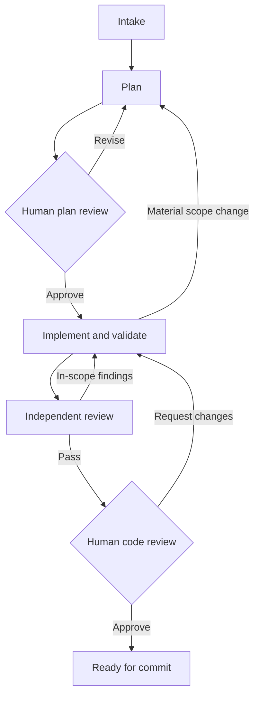

# LFG: implementation specification

Prepared 12 September 2026. This is a proposed build specification, not an implemented or installed plugin.

## Goal

Hand a Jira ticket or specification to an agent workflow that gathers sufficient evidence, produces a minimal implementation plan, waits for human approval, implements and verifies the approved work, receives independent code review, and returns for final human review. The normal terminal state is **Ready for commit**. Committing, pushing, publishing comments and creating a PR are separate actions.

The first release should make one complete task reliable on one host and one repository. The same package can subsequently be configured on other Paseo hosts. It should not introduce a central service, a second code graph, a general-purpose workflow designer or automatic account switching.

## Decisions

| Area | Decision |
| --- | --- |
| Product | One private Paseo plugin, `lfg`, with a workspace panel and a small run list. |
| Agent behavior | Four role skills: intake, plan, implement and review, with a shared scope/evidence contract. |
| Code intelligence | Existing Gortex MCP integration. Controller-side CLI diagnostics where appropriate. |
| Orchestration | A small deterministic controller in the plugin's daemon subprocess. The model does not own the workflow state machine. |
| Persistence | A small embedded SQLite store for run state, approvals and pending actions; immutable Markdown/JSON evidence on host-local disk. No separate database server. Validate the SQLite driver against the actual plugin runtime during the compatibility milestone. |
| UI | React Native components using Paseo's theme and supported navigation. Ordinary Paseo agent sessions remain the place for conversation. |
| Contracts | TypeScript and Zod, plus JSON output schemas for worker results. |
| Reasoning | Saved Paseo profiles selected by role and task risk; medium implementation, high planning/review as starting defaults. |
| Workspace ownership | Paseo creates and owns the task worktree. One source-writing agent at a time per run. |
| Integrations | Reuse available Jira/MCP and CLI access before adding custom adapters. Host-specific credentials remain on the host. |
| Existing plugins | Agent Monitor for visibility; Review Deck optionally for human diff inspection. Neither owns LFG approvals or completion. |

The selected Paseo release and matching plugin SDK must be tested together. The inspected documentation is for the v0.8 plugin contract. Use the target host's scaffold and official `paseo-plugin` authoring skill during implementation, verify its actual API availability, and bound the supported version range. Do not infer that every current documentation feature exists in every 0.8 build. Supporting both 0.7 and 0.8 is outside the first release.

Sources: [Paseo plugin API](https://paseo.sh/docs/plugins/v0.8/reference), [agent SDK](https://paseo.sh/docs/sdk/agents), [agent profiles](https://paseo.sh/docs/agent-profiles).

## User experience

The user opens LFG in a project and supplies a Jira key/URL, pasted specification or specification file. The current host and project prefill when available. A run shows its stage, the question or action needing attention, active agent, effective model/effort when observable, and relevant evidence.

Use four views inside the run: **Overview, Evidence, Plan, Review**. Evidence and Plan can initially be rendered Markdown. Review combines the task summary, verification results, unresolved findings and navigation to the native workspace changes. A sophisticated custom diff editor is not required.

The normal user actions are:

1. Start a task.
2. Answer a material unresolved requirement if intake cannot settle it from evidence.
3. Approve the plan or request a revision.
4. Review the implementation and approve it or request changes.
5. Commit/push/create the PR separately after the workflow is ready.

Pause, resume and cancel are always available where meaningful. Canceling a run cancels or reconciles its active agent; it does not delete its worktree or discard code. Native Paseo permission requests remain distinct from the two LFG review gates.

Start with a panel and Command Center action. Add `/lfg` and one updating timeline status row after the complete workflow passes its acceptance scenarios. Composer attachments and additional timeline renderers can follow later.

## Workflow and gates

Every active stage may also enter Needs input, Blocked, Failed or Paused with a specific reason and preserved evidence. Two unsuccessful automatic repair rounds is the proposed initial limit; then the user receives a concrete unresolved finding or decision. The system must not keep cycling indefinitely or downgrade a blocker just to finish.

### Gate 1: plan approval

Approval identifies the exact plan revision, requirements revision and relevant source baseline. The planner can propose revisions, but cannot approve them. The implementer is launched only after the controller accepts that approval.

A material change in behavior, architecture, dependency, affected system, migration or risk requires a plan amendment. Progress is recorded separately from the approved plan. An unexpected adjacent helper or test within the approved behavior is disclosed and assessed under the scope policy; an expected-files list should not create a new approval for every harmless filename adjustment.

### Gate 2: final review

Approval identifies the actual reviewed code snapshot, not just a branch name or HEAD commit. Account for index, worktree and task-owned untracked content, including renames and deletions. Any subsequent source change invalidates the relevant review and verification results until rechecked.

The controller accepts an approval only for its current revision. A stale browser tab or repeated button press cannot approve a newer plan or start implementation twice.

### Authority

Normal workflow transitions are controlled by the daemon service. The worker result schema contains no approval capability. Human approval is a separate UI action handled by the controller, never a phrase parsed from agent text.

Source-write and external-system restrictions must also be backed by provider/harness permissions and read-only credentials where applicable. A prompt, a hook or a plugin sharing the host user's operating-system access is not an adversarial security sandbox. The first milestone must demonstrate the intended restrictions on each provider before calling them enforced.

## Skills and outputs

The four skills share one maintained definition of scope, evidence, stop conditions, source authority and handoff format. They reuse selected upstream Gortex skills rather than copying the complete Compound Engineering, Superpowers or GitNexus suites.

| Skill | Job | Required output |
| --- | --- | --- |
| `lfg-intake` | Resolve the task and gather relevant Jira/spec, source, database and cloud evidence. | Evidence brief, acceptance criteria, observations versus assumptions, unresolved questions, suggested risk classification. |
| `lfg-plan` | Turn evidence into the smallest sufficient implementation plan. Perform focused follow-up investigation where needed. | Plan, explicit non-goals, intended files/symbols, existing patterns, behavior-focused test scenarios, runnable verification commands, risks and context handoff. |
| `lfg-implement` | Execute the approved plan, make scoped edits, run required checks and report deviations. | Structured completion/blocker result, changed-file manifest, acceptance-criterion mapping, verification evidence and source snapshot. |
| `lfg-review` | Independently inspect actual source and evidence against the requirements and approved plan. | Separate specification-compliance and code-quality verdicts, actionable findings and verified disposition of prior findings. |

Every worker returns `complete`, `blocked` or `failed`, with artifact references and a concise summary. These are proposed LFG result values, not Paseo turn statuses. An idle/completed agent turn does not prove the stage succeeded. Parse and validate the structured output, then independently verify the stage's required evidence.

Use Paseo's structured-output facility where the selected provider supports it. Otherwise require one schema-validated result artifact and provide a bounded formatting-repair path. Do not infer success from free text such as “done” or “tests pass.”

The implementer can run focused tests while working. For the completion gate, the controller executes the project's required, plan-approved verification commands through its daemon-side process runner and captures command, working directory, exit status and output reference directly. Bind those receipts to the source snapshot and environment. Reuse a valid receipt for unchanged inputs instead of repeatedly running the same suite; invalidate it when relevant source, configuration or environment inputs change. A worker's own JSON claim is not an authoritative command receipt. This adds independent verification without creating a fifth test agent.

Source: [Paseo structured results and turn lifecycle](https://paseo.sh/docs/sdk/agents).

### Shared scope rules

- Every change supports an acceptance criterion, an approved plan step or necessary verification.
- Preserve working repository conventions. New abstractions, dependencies, generalized extension points and structural rewrites need a present-task justification.
- No unrelated cleanup, broad formatting, speculative extensibility or opportunistic repo-wide fixes.
- Investigate until the implementation questions are answered; additional exploration requires a remaining question.
- Test changed behavior proportionately. Prefer reusing or strengthening existing tests over adding redundant ones. Nonbehavioral work uses relevant checks with an explicit rationale.
- Required evidence that cannot be obtained is visible as a limitation or blocker, never a fabricated passing result.
- Review can challenge an incorrect approved plan. Confirmed defects are not waived simply to preserve the plan.
- No automatic risk acknowledgments, permanent finding suppressions, commits, pushes, PR creation, Jira comments or posted code-review comments.

Borrow the context ledger and source provenance from GitNexus, the scope-guardian and structured handoff practices from Compound Engineering, and the independent dual-verdict review and verification discipline from Superpowers. Implement these as a coherent policy rather than stacking all their orchestration behaviors.

## Gortex integration

Gortex is required in the first end-to-end slice. Use native MCP for the workers. The plugin backend may invoke Gortex CLI diagnostics through an argument-array process runner on the same host. It should not create another graph engine or automatically rebuild every repository at each stage.

| Stage | Selected tools/skills |
| --- | --- |
| Preflight | `capabilities`, `workspace` health/checkouts; exact-view CLI diagnostics when needed. |
| Intake | `gortex-guide`, `gortex-explore`; `explore`, `search`, `read`, `relations`. Targeted `trace` or `analyze` only for a concrete question. |
| Plan | `gortex-impact`; `change` impact, contract/signature preflight and test targeting. |
| Implement | `gortex-safe-edit`; `read` editing context, supported `edit` operations, previews and mutation receipts. `gortex-add-test` when appropriate. |
| Review | One of `gortex-pr-review` or `gortex-pr-review-agent`; actual-worktree review and focused dependent/contract inspection. |

Implementation requirements from the prior v0.64.3 audit:

1. Prove the requested worktree is the view answering the query. Incomplete or degraded graph evidence is explicitly represented. Do not silently substitute the primary checkout's graph.
2. Resolve operation schemas through capabilities and keep compact and legacy request schemas separate.
3. Track pending source mutations through receipts before retrying. Preview success is not mutation completion.
4. Build an independent changed-file manifest. Gortex change detection uses Git diff and does not observe untracked files.
5. Run graph-dependent review checks against the actual worktree. A pasted diff skips review-pack gates requiring indexed symbols. Review new-file source and explicitly include relevant indexed symbols in applicable checks after publication.
6. Select actual repository build/test commands; a suggested command is not proof it covers this repository or language.
7. Treat Gortex workflow/planning modes as supplementary session aids. They do not store the human approval or enforce the multi-agent workflow.
8. Verify read-only exposure through the harness: Gortex's compact preset is a fixed surface and does not honor allow/deny deltas as a way to remove individual compact tools.

Sources: [Gortex facade contract](https://github.com/zzet/gortex/blob/v0.64.3/docs/mcp-facade-v1.md), [change detection](https://github.com/zzet/gortex/blob/v0.64.3/internal/mcp/tools_analysis.go), [review implementation](https://github.com/zzet/gortex/blob/v0.64.3/internal/mcp/tools_review.go). The preceding full Gortex audit remains the detailed operation catalog.

## Reasoning selection

Use Paseo profiles as the authoritative launch settings for this workflow. Avoid maintaining conflicting defaults in a skill, a shell variable and the controller. Record requested settings and effective settings when the provider reports them; otherwise mark the effective value unverified.

| Role/task | Starting effort | Escalation |
| --- | --- | --- |
| Intake | Medium | High for difficult diagnosis or conflicting evidence. |
| Planner | High | Highest only for a named unusually difficult technical decision. |
| Implementer | Medium | High for a plan-identified difficult/risky change or a demonstrated reasoning failure. |
| Reviewer | High | Targeted deeper investigation where concrete evidence warrants it. |
| Mechanical follow-up/summary | Low or medium | Only if the work turns out to require substantive judgment. |

Do not add a separate model-based classifier to version one. The role supplies the default; intake/plan risk findings and a small explicit policy determine escalation. Missing credentials, failed tools or absent requirements are not reasons to increase effort. Highest effort is not inherited accidentally from the initiating conversation.

Settings are provider/model-specific. Discover valid model and thinking-option IDs and map the role profile to them. An unavailable configured profile is a visible setup problem or disclosed configured fallback, not a silent model substitution.

The LFG controller applies settings when creating each worker. A scoped before-create hook may help normalize LFG-owned launches once verified, but a broad global hook must not change unrelated agents. Initial version acceptance should inspect the actual launch settings, not merely the prompt's requested effort.

Source: [Paseo profiles](https://paseo.sh/docs/agent-profiles).

## Intake integrations and project configuration

Separate portable project policy from machine-specific bindings and credentials.

| Portable project configuration | Host-local bindings |
| --- | --- |
| Base branch and relevant repository paths | Actual repository root and executable paths |
| Required tests/builds and conditional check rules | Installed runtimes and tool availability |
| Scope rules and task-relevant source types | Jira connection/MCP server and account selection |
| Database/cloud environment aliases | Credential references and read-only connection details |
| Role profile names and escalation policy | Profile IDs, model IDs and supported thinking settings |
| Integration/UI test prerequisites | Dev/test environment availability |

Any new configuration file name is part of our plugin contract, not an existing Paseo feature. Use host-scoped Paseo plugin settings for machine bindings where suitable. Do not duplicate secrets into the source repository, client bundle, prompts or final evidence packet.

### Jira

Read the requested issue, its acceptance criteria and description, relevant comments, the parent feature/epic and linked issues that affect the work. Record sources and timestamps, distinguish stale comments from later decisions, and preserve a stable snapshot. Stop at relevant links instead of recursively reading the entire Jira project.

Prefer an already working Jira MCP integration for the first real-ticket pilot. Add a small daemon-side Jira REST adapter only if the existing integration cannot produce the required repeatable evidence. Searchable composer attachments are later UI work, not a prerequisite.

### SQL and cloud

Intake queries are read-only and answer concrete questions. A SQL adapter can use `sqlcmd` with the actual project connection alias and appropriate output limits/timeouts. Database permissions enforce read-only access; a text check for `SELECT` is insufficient. Cloud investigation uses the selected environment/account and relevant resource configuration or logs.

Use a direct executable plus argument array for process invocation. Verification commands involving database writes or cloud changes target an approved development/test environment and belong in the approved plan. Tool output is bounded and sensitive values are omitted or redacted from durable artifacts.

The first release implements only the database/cloud adapter actually required by the pilot project. There is no generic cloud abstraction layer.

## Controller implementation

### Modules

Keep one repository with the Paseo scaffold's `index.client.tsx`, `index.server.ts`, `paseo-plugin.json`, package manifest and compiler configuration. Runtime modules live under `client/`, `server/` and `shared/` as required by the plugin contract. Markdown skills and documentation are separate source assets.

| Module | Responsibility |
| --- | --- |
| `client/launch.tsx` | Task input and project/profile selection. |
| `client/run.tsx` | Status, evidence, plan, review and approval actions. |
| `server/engine.ts` | Allowed transitions, stage validation and dispatch decisions. |
| `server/store.ts` | SQLite transactions, revision checks, action intents and recovery. |
| `server/paseo.ts` | SDK agent/workspace operations and lifecycle-event reconciliation. |
| `server/gortex.ts` | Capability/health/view checks and controller diagnostics. |
| `server/process.ts` | Argument-array command execution, required verification receipts, timeouts and output handling. |
| `server/integrations/` | Only the Jira/SQL/cloud adapters needed by configured projects. |
| `shared/contracts.ts` | RPC and artifact schemas, run-state types. |
| `shared/routing.ts` | Small role/risk policy; no extra classifier agent. |
| `skills/` | Four role skill sources and shared reference material. |

Use one minimal test harness with dependency-injected adapters for state-machine failure scenarios and a small number of real host integration checks. Do not create a generic plugin framework around these modules.

### Persistence and artifacts

The SQLite store needs run records, worker attempts, approval records, revisioned events and pending action intents. A transaction validates the current state/revision and records the next action before dispatch. Workers write or return evidence through the designated mechanism; they do not edit the controller database.

Artifacts are stored outside the source worktree, so workflow progress does not contaminate the code diff. Each run retains an evidence brief, plan revisions, context packet, implementation result, verification results, review results and final summary. The controller checks hashes and source references before advancing. The UI renders these files without making the model regenerate them for display.

### Event handling and restart

Use supported daemon lifecycle events such as `agent.turn_ended` to notice work ending. Associate every worker with the run, role and attempt, and validate the matching result. Unrelated agents and duplicate events are ignored. A completed turn can still mean the worker is blocked or merely asking a question.

Paseo's documented hooks run without an app connected, and their contexts provide the SDK. Keep workflow continuation on the daemon. The browser/phone sends actions and renders state; it does not keep the workflow alive.

Persist the dispatch intent before creating an agent and use stable run/attempt labels for reconciliation. If an SDK timeout or crash makes creation uncertain, inspect existing agents before retrying. If identity cannot be resolved safely, leave the run recovering/blocked rather than creating a possible duplicate. A wait timeout alone does not mean the agent stopped.

For version one, an explicit **Resume** after daemon/plugin restart is acceptable. It must reconcile existing work, preserve approvals and source artifacts, and continue the correct stage without reimplementing completed work. Unattended cold-start recovery can follow after the lifecycle/bootstrap integration is proven.

Sources: [daemon hooks and backend SDK](https://paseo.sh/docs/plugins/v0.8/reference), [SDK wait statuses and agent labels](https://paseo.sh/docs/sdk/agents), [lifecycle types](https://github.com/getpaseo/paseo/blob/main/packages/plugin/src/server/lifecycle.ts).

## Reusing existing plugins

Agent Monitor can continue to show the normal Paseo workers because LFG uses native agent/workspace records. Add understandable labels/titles; no dependency on its internal data store is needed.

Review Deck can be used to inspect the diff and annotate feedback, but its comment handoff is not verified completion. Its documented queue can clear a comment after submission to an agent. LFG must track findings, fixes and verification in its own records. Initially use LFG's Request changes action for tracked repair work and supported native navigation for inspection. Do not assume a public cross-plugin API exists, import private plugin modules or scrape another plugin's state.

If code changes through Review Deck or outside LFG, source-snapshot invalidation forces the relevant checks and review to run again. A later explicit integration can forward comments while retaining stable IDs and acknowledgments, if a supported API is available.

Sources: [Agent Monitor](https://github.com/omercnet/paseo-plugins/tree/main/agent-monitor), [Review Deck](https://github.com/mentalfl0w/review-deck).

Paseo Hub's documented YAML workflows are another orchestration option, including finite profile/environment selection. The reviewed documentation did not establish the two revision-bound human approval gates needed here. Reassess it if a supported gate/recovery contract becomes available; introducing Hub is not required for this host-local first release. [Hub workflows](https://paseo.sh/docs/hub/workflows).

## Ordered implementation backlog

| Milestone | Deliverable | Acceptance condition |
| --- | --- | --- |
| 0. Compatibility proof | Record host/app/daemon versions, scaffold matching SDK, verify backend SDK/lifecycle access, SQLite packaging, profiles and Gortex routing. | A worker can be created and observed with the app closed; its profile is inspectable; Gortex answers for the correct worktree; intended role permissions are demonstrated. |
| 1. Complete specification-driven run | Four role skills, result schemas, persistent controller, two approval actions and minimal panel. Use a small supplied spec in one repository. | Intake → plan → approval → implementation/tests → independent review → human review → ready, with no commit/push/PR. |
| 2. Real-ticket intake | Wire the existing Jira integration, related evidence, and the pilot project's required SQL/cloud access. | A real ticket produces a source-linked brief with materially complete requirements and visible unknowns; investigation makes no source/database/cloud changes. |
| 3. Failure and drift handling | Repair loop, snapshot invalidation, idempotent transitions, cancel/resume and recovery. | The failure scenarios below pass; restarts and duplicate events do not lose approvals or create duplicate work. |
| 4. Daily-use UI | Run list, native navigation, concise timeline status, profile/evidence display and tracked Request changes. | Both desktop and phone can review a plan, submit a decision and see the same durable state; closing either client leaves active work running. |
| 5. Pilot and rollout | One ordinary bug, one feature and one difficult integration/regression task, then both provider adapters and another host. | Review shows no unexplained scope expansion; evidence is accurate; intended reasoning is applied; setup can be reproduced with project/host bindings. |

Each milestone is reviewable independently. Do not spend the initial milestone building a dashboard, a graph explorer or a workflow editor. The first useful product is a fully completed task with trustworthy gates and evidence.

## Required acceptance scenarios

1. **Happy path:** all four roles complete; both human gates are required; the final state is ready with uncommitted code.
2. **Material missing requirement:** intake pauses with a focused question; subsequent stages cannot fabricate an answer.
3. **Stale or duplicate approval:** a changed plan or old client revision cannot be approved, and repeated approval does not spawn another implementer.
4. **Scope expansion:** a new behavior, dependency or architectural change returns for a plan amendment.
5. **New source file:** a relevant untracked file is present in the manifest and review despite Git diff/Gortex limitations.
6. **Failed or unavailable verification:** completion is blocked or explicitly limited; missing commands/results cannot appear as passing tests.
7. **Review rejection:** a real finding returns to implementation, is rechecked after repair, and remains unresolved if the repair limit is exhausted.
8. **External edit after review:** the source snapshot changes and invalidates the prior relevant results and approval.
9. **App closes:** active daemon workflow continues and can reach the next human gate without a connected UI.
10. **Restart or uncertain SDK request:** Resume reconciles existing workers and preserves the run rather than duplicating work or silently marking completion.
11. **Wrong graph/view or unsupported capability:** the stage returns a concrete setup/recovery problem instead of relying on the wrong checkout or invented tools.
12. **Wrong effort or profile:** effective settings are checked where available; an override or unavailable profile is visible.
13. **Permission boundary:** intake/planner/reviewer source writes and unauthorized external writes are actually restricted by the selected provider/tool configuration.
14. **No shipping:** no ordinary completion, recovery or repair path commits, pushes, creates a PR or publishes comments.

## Later work

After the complete workflow is reliable, consider Gortex symbol/context attachment sources, richer impact/review rendering, optional verified learning, a supported Review Deck feedback integration and user-triggered commit/PR drafting. Host-first sidebar grouping remains a separate Paseo core contribution. Account switching and cross-host scheduling are separate projects.

The first implementation handoff is **Milestone 0 plus Milestone 1**: prove the actual host integration, then complete one small specification-driven task end to end with Gortex and the two review gates. This document defines the proposed build; no plugin, skill installation, host configuration or production changes were made while preparing it.
