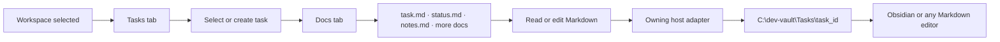

# Dev Vault in Mission Control

22 September 2026 · Working design

## Decision

`C:\dev-vault` is the Host Brain for `personal` and an ordinary Obsidian vault: Markdown files and folders remain usable in Obsidian, a text editor, and Mission Control. Mission Control reads and writes through the adapter on the owning Paseo host. It does not embed the Obsidian application or require an Obsidian community plugin. Each future Windows host uses its own `C:\dev-vault`; a remote host must run its own scoped adapter before Mission Control edits that host's files.

Keep **one stable folder per task ID**. Names and projects can change without moving the folder. `task.md` contains the task ID, assignment, lifecycle status, and acceptance criteria. `status.md` is a human-readable progress log; it does not override the lifecycle field in `task.md`. `notes.md` is freeform. More Markdown documents can be added in the task folder as work develops. Attachments belong in its `attachments/` folder; browsing/uploading them is a later slice.

```text
C:\dev-vault\
├─ .obsidian/                 Obsidian's own per-vault settings
├─ host.json                 owning Paseo host identity
├─ README.md                 vault conventions
├─ Projects/                 project briefs and links to tasks
├─ Tasks/
│  └─ task_<stable-id>/
│     ├─ task.md             canonical task record (frontmatter + brief)
│     ├─ status.md           progress, blockers, next step
│     ├─ notes.md            working notes
│     ├─ plan.md             optional, created when useful
│     └─ attachments/        supporting files, later UI support
├─ Daily/                    future morning/nightly checkpoints
└─ Templates/                optional human-use templates
```

Existing flat `Tasks/task_<id>.md` records are read during transition. The pilot record can be moved into its task folder without changing its ID or assignment. New tasks use folders. Obsidian recognizes the notes because they are ordinary Markdown; it can link them with paths such as `[[Tasks/task_<id>/task|Task title]]`.

## Visual flow

Editable diagrams: [vault architecture](dev-vault-architecture.excalidraw) and [desktop/phone Docs wireframe](docs-view-wireframe.excalidraw).



### Desktop

```text
┌ Hosts ┐ ┌ Workspace / task context ┐ ┌ Docs in dev-vault ──────────────────────────┐
│personal│ │ Workspaces Attention Tasks │ │ task_<id>  ·  personal / project / workspace │
│remote  │ │ Docs                       │ │ [task.md] [status.md] [notes.md] [+ doc]    │
│        │ │ Select a workspace and task│ │                                            │
│        │ │                            │ │ # Status log                               │
│        │ │                            │ │ ...Markdown editor...                      │
│        │ │                            │ │                                            │
│        │ │                            │ │ [Save] [Reload]  revision/conflict message│
└────────┘ └────────────────────────────┘ └────────────────────────────────────────────┘
```

The task list remains visible while editing a document. The Docs pane shows the owning host and path, and makes unsaved changes obvious. `task.md` is readable; lifecycle status is changed through the Tasks view, which preserves the Markdown body. Other Markdown documents are editable. Save checks the revision originally loaded against the current file and rejects a stale draft. The user can then discard and reload the external version.

### Phone

```text
┌ Mission Control ───────────────┐
│ [Workspaces] [Tasks] [Docs]     │
│ personal · development-flow    │
│ Task: Build Mission Control…   │
│ [task.md] [status.md] [notes.md]│
│                                │
│ # Status log                   │
│ ...full-width Markdown editor..│
│                                │
│ [Save changes]                  │
└────────────────────────────────┘
```

On compact screens the Docs pane comes before the long workspace list, with one vertical page scroll and a back action. File and task selectors scroll horizontally. Editing remains in Mission Control; an optional **Open in Obsidian** deep link can be added after testing vault availability on desktop and mobile. An Obsidian URI opens a note on the current device, so it cannot replace the host adapter for remote editing.

## Built and checked

- New tasks create their own folder with `task.md`, `status.md`, `notes.md`, and `attachments/`. The pilot task was moved from the flat format without changing its ID; legacy flat records remain readable.
- The Docs tab reads Markdown, offers a simple heading-aware preview, edits notes, creates additional `.md` files, and has Save and Reload actions. `task.md` stays read-only in Docs.
- A stale save is rejected when the document changed outside Mission Control. This was checked by editing `notes.md` on disk while a draft was open, then using Discard & reload to load the external version.
- Tasks can change lifecycle status without hand-editing frontmatter. The List/Board toggle groups tasks into Inbox, Doing, Review, and Delivered lanes; changing status moves the card.
- The plugin typecheck passed, and the Docs and Board views were inspected in Paseo at desktop and 390 px phone width. The newly created task and its documents remained after plugin reload.

## Next build decision

Add lightweight Mission Control settings for host and project visibility, manual ordering, host emoji, and a default view. This addresses the large-host navigation problem before adding more panels. Keep these as presentation preferences; task records and host vaults remain independent. Then make `C:\dev-vault` setup repeatable on other hosts so their own adapters can serve remote task documents. Attachments and an optional Obsidian deep link can follow after host vault setup.
