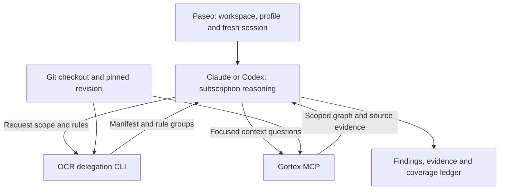
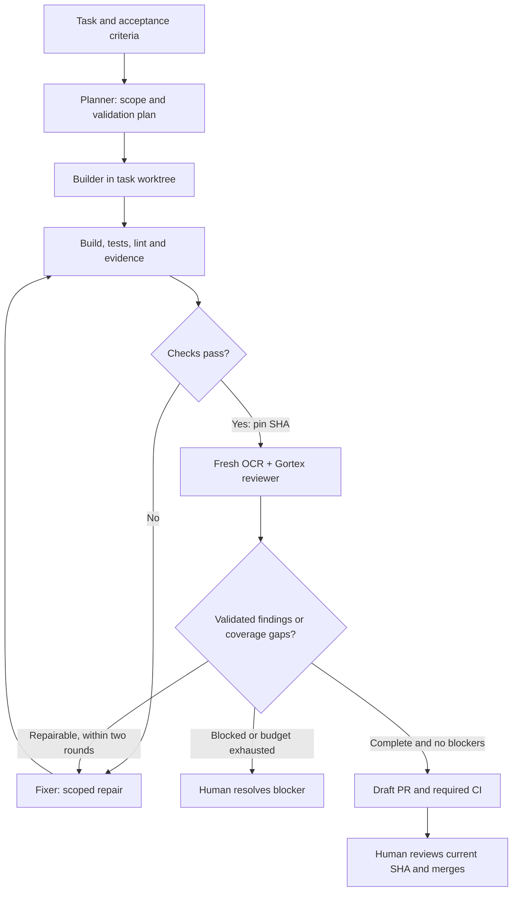

# OCR + Paseo + Gortex for subscription-backed .NET development

**Research date: 16 September 2026 (UTC).** This report distinguishes released behavior, unreleased changes, open proposals, project claims and independently checked observations. The companion `windows-setup.md`, `csharp-dotnet.md`, `global-rule.json`, `reviewer-prompt.md` and `review-output.schema.json` are the implementation kit.

## Recommendation

Use **Paseo to start a fresh Claude/Codex reviewer in the existing workspace; use OCR Delegation Mode for the review manifest and resolved rules; let that reviewer query Gortex for context**. Keep Git as the authority for the reviewed revision and your existing build/test/CI commands as the deterministic gates. Start with a committed branch comparison against `main`. A reusable prompt plus the upstream delegation skill is sufficient today.

Your proposed separation is largely right, with one important correction: **delegated OCR does not execute or enforce the review, validate final findings, or certify coverage**. Those jobs remain with the host agent and, later, a very small manifest/report validator. Also, Gortex graph results need checkout/freshness checks and are not a substitute for C# compiler semantics. [Delegation source](https://github.com/alibaba/open-code-review/blob/v1.12.3/cmd/opencodereview/delegate_cmd.go), [upstream workflow](https://github.com/alibaba/open-code-review/blob/v1.12.3/skills/open-code-review-delegate/SKILL.md)

There is no reason to install Ralphy, Gas Town, Gas City or Archon on top of Paseo for this workflow. The most useful next improvement is a bounded review/fix handoff with durable evidence, not another agent runtime.

### Verified snapshot

| Project | Latest stable release observed | Source inspected | Important distinction |
|---|---|---|---|
| Alibaba OCR | [1.12.3, Sep 16](https://github.com/alibaba/open-code-review/releases/tag/v1.12.3) | `71ed3a288df6435f240b7194f19041b4fcc4ab7d` | Native Codex subscription-auth PR remains open. |
| Paseo | [0.8.0, Sep 10](https://github.com/getpaseo/paseo/releases/tag/v0.8.0) | Release plus main `0eac75be7dd11a6623abb763b3a44d23e711c550` | 0.8 plugin API remains experimental; some docs still say beta. |
| Gortex | [0.64.3, Sep 10](https://github.com/zzet/gortex/releases/tag/v0.64.3) | Release plus main `fdf7fd02d3f0db59b5a7ca834423850f9da567ba` | Worktree improvements continue after release; PR #806 is not shipped. |

I inspected repository source, versioned docs, release metadata, current issues/PRs, the live paseo.cafe catalog and selected plugin code. I ran OCR 1.12.3 locally against Git fixtures without configuring an LLM. I did **not** run a live Windows + Paseo + Gortex + subscription-agent session, or benchmark this new C# rule on production projects. Negative search results below mean “not found in this investigation,” not proof that no unpublished implementation exists.

## Architecture and responsibility boundaries



**There is no OCR-to-Gortex call in this delegated architecture.** OCR's CLI gathers Git state and resolves rule text; the host agent fetches patches and chooses additional context tools. Full API-driven OCR can connect to MCP servers separately, but that is a different execution path with separately configured credentials and tool connections. [Delegate implementation](https://github.com/alibaba/open-code-review/blob/v1.12.3/cmd/opencodereview/delegate_cmd.go), [OCR architecture](https://github.com/alibaba/open-code-review/blob/v1.12.3/pages/src/content/docs/en/architecture.md)

| Responsibility | Owner | Boundary |
|---|---|---|
| Workspaces, worktrees, provider/model settings, sessions, UI, orchestration | Paseo | Reuse its existing lifecycle; do not build a second scheduler initially. |
| Changed-file enumeration, scope metadata, exclusions, rule resolution | OCR | Deterministic within its implemented selection policy, which excludes some changed files. |
| Canonical comment fields/checklist | OCR convention | Host adds evidence/confidence and emits the final report. |
| Coverage execution/accounting | Host reviewer; later a small validator | OCR supplies the manifest. The delegated checklist is not a machine-enforced certificate. |
| Symbols, relationships, dependencies, context retrieval | Gortex | Selected checkout, language support, indexed repos and freshness constrain results. |
| Hypotheses, evidence gathering, defect judgment | Claude/Codex | Use actual consumers/guards before asserting a defect. |
| Fixes | Separately authorized builder/fixer | Do not let the reviewing session silently become a fixer. |
| Revision truth and deterministic validation | Git and repository CI/scripts | The reviewed SHA and passed commands must match the proposed PR. |
| Merge | Human | A clean AI report is evidence for this decision, not merge authority. |

## OCR: what works today

### Managed OCR versus delegation

Managed OCR's review pipeline is more than “send a diff to an LLM”: it selects files, forms bounded groups, plans where appropriate, runs a tool-using review loop, anchors candidate comments, filters/refines them and produces structured output/manifests. Grouping includes LLM decisions; it is inaccurate to describe every step as deterministic. Its built-in tools include file reading/search/diff retrieval and comment/task completion. External MCP support is available for this managed loop. [Architecture](https://github.com/alibaba/open-code-review/blob/v1.12.3/pages/src/content/docs/en/architecture.md), [agent implementation](https://github.com/alibaba/open-code-review/tree/v1.12.3/internal/agent), [LLM loop](https://github.com/alibaba/open-code-review/tree/v1.12.3/internal/llmloop)

Delegation currently exposes **two** engineering operations:

```text
ocr delegate preview --from main --to HEAD --format json
ocr delegate rule --format json <reviewable-paths...>
```

Preview returns schema version `"1"`, repository/mode/ref metadata, a merge base where applicable, totals, reviewable rows and excluded rows with reasons. Rule output groups paths that resolve to identical rule text. Neither command calls an LLM. The skill tells the host to fetch Git diffs, review every selected entry, use context tools as needed and self-report coverage. It does not emit the patch itself. [Command source](https://github.com/alibaba/open-code-review/blob/v1.12.3/cmd/opencodereview/delegate_cmd.go)

| Capability | Managed `ocr review` / `scan` | `ocr delegate` + host |
|---|---|---|
| LLM credentials | OCR provider configuration | Host's normal Claude/Codex authentication |
| File/rule selection | OCR | OCR |
| Patch/context exploration | OCR review loop and configured tools | Host Git + host MCP/tools |
| Planner, iterative rounds, reflection/filter | Implemented pipeline | Not inherited automatically; prompt can ask for similar reasoning |
| Finding anchoring/normalization | OCR implementation, with known edge cases | Host responsibility |
| JSON findings | Native structured report | Host-generated JSON; supplied schema is our extension |
| SARIF | Native supported output | Not a delegation output format |
| Coverage manifest/checkpoint | Managed run/session implementation | Preview plus host ledger; no delegated run/session engine |
| Resume/retry | Managed features and limitations below | Host/Paseo session or saved artifact; no `delegate resume` |
| Whole-repository scan | Separate managed scan engine | Delegated full-file scan PR is open |

Do not confuse `ocr review --audience agent` with delegation: agent-facing formatting does **not** stop OCR making its own provider calls. Likewise, installing the ordinary OCR plugin/skill does not make its managed review bill the host subscription. [Review command](https://github.com/alibaba/open-code-review/blob/v1.12.3/cmd/opencodereview/review_cmd.go), [delegation documentation](https://github.com/alibaba/open-code-review/blob/v1.12.3/pages/src/content/docs/en/integrations/delegate.md)

### Subscription support and roadmap status

**Released solution:** use delegation under a subscription-authenticated official provider CLI. Paseo documents both ChatGPT-authenticated Codex and Claude Code plan usage without a separate Paseo model charge. Usage still counts against your plan; parallel agents and repeated reviews do not bypass quotas. OpenCode's supported authentication depends on the actual provider; “OpenCode integration” does not make every vendor subscription portable. [Paseo Codex](https://github.com/getpaseo/paseo/blob/v0.8.0/public-docs/codex.md), [Paseo Claude](https://github.com/getpaseo/paseo/blob/v0.8.0/public-docs/claude-code.md)

| Item | Status at check | Meaning |
|---|---|---|
| [OCR #331: reuse Claude Code login](https://github.com/alibaba/open-code-review/issues/331) | Open; updated Jul 9 | Request, not direct Claude subscription authentication in released OCR. Delegation addresses much of the desired workflow. |
| [OCR #275: Codex-native runner](https://github.com/alibaba/open-code-review/issues/275) | Open; updated Jul 17 | Historical request/discussion; do not treat older endpoint claims as definitive current product support. |
| [OCR #1105](https://github.com/alibaba/open-code-review/issues/1105), [PR #1106](https://github.com/alibaba/open-code-review/pull/1106) | PR open, unmerged; updated Sep 15 | Proposed local ChatGPT/Codex subscription auth for managed reviews. Not in 1.12.3; author explicitly excludes the GitHub Action path. |
| [OCR #985 / PR #986](https://github.com/alibaba/open-code-review/pull/986) | Open | Proposed single delegated task packet; do not use a nonexistent released `delegate task` command. |
| [OCR PR #982](https://github.com/alibaba/open-code-review/pull/982) | Open | Proposed delegated full-file scan plan. |

I would not use experimental token reuse, an OAuth proxy or an unmerged auth fork for your first setup. The released delegation path already achieves your billing goal without depending on those proposals. Avoid Gortex's optional model-assisted/embedding features if you also want its context path free of separate provider charges; basic local graph retrieval is sufficient here.

### Modes, untracked files and actual selection

| Requested review | OCR invocation | What is selected / host patch source |
|---|---|---|
| Current branch against main | `delegate preview --from main --to HEAD` | Merge-base-to-HEAD committed changes. Host uses returned merge base. |
| Specific commit | `delegate preview --commit <sha>` | Commit delta; merge commits use first-parent behavior. |
| Current workspace | `delegate preview` | Tracked staged/unstaged changes plus untracked additions. Host uses HEAD diff and direct/new-file source. |
| Whole repository | Managed `scan` | Different engine and token economics; not today's subscription-delegation recipe. |

Pin resolved base/head SHAs for repeatability. `main` may be stale; choose `origin/main` after an intentional fetch if remote freshness is what you mean. A fresh agent in the same worktree sees the same branch, but only if its CWD is that worktree. Passing `--repo` helps OCR; Gortex must independently select the same checkout. [Git provider](https://github.com/alibaba/open-code-review/blob/v1.12.3/internal/diff/git.go)

The selection order has consequential limits. Provider-level directory filters can omit paths such as `vendor`, `node_modules` and `target` before later selection. Subsequent policy handles deleted/binary files, unconditional secret exclusions, user excludes, user includes, supported extensions and default path/test exclusions. A user include can admit unsupported extensions and default-excluded tests; it is not a whitelist and does not defeat the unconditional secret/provider policies. [Selection](https://github.com/alibaba/open-code-review/blob/v1.12.3/internal/agent/selection.go), [allowlist](https://github.com/alibaba/open-code-review/blob/v1.12.3/internal/config/allowlist/supported_file_types.json), [exclusion reasons](https://github.com/alibaba/open-code-review/blob/v1.12.3/internal/model/preview.go)

Specific consequences for your stack:

- `.cs` is supported, but `.csproj`, `.props`, `.targets`, `.cshtml`, `.razor` and `.csx` need explicit eligibility overrides. The supplied global configuration includes them.
- Default frontend test exclusions can hide `.spec.ts` / `.test.tsx`; use explicit includes when review coverage should include them. C# test files are ordinary `.cs` paths unless another exclusion applies.
- Deleted files appear in the excluded ledger because there is no new file to review. You still need a supplemental deletion-impact check for removed callers/contracts.
- Add .NET `bin`/`obj` exclusions; do not indiscriminately exclude migrations/model snapshots or DTOs.
- Workspace `(path,status)` identity matters: staged deletion followed by untracked recreation can create two manifest entries for one path.

Managed review can exclude an excessively large diff against its configured token budget. Delegation deliberately does not apply that managed-template limit. That does **not** make a huge diff fit the host context: batch it and report truncation/skips explicitly. Unreadable untracked files can be skipped during synthesis, and binary detection has an edge case described below. A reviewable-file count is therefore not “all repository changes fully analyzed.” [Selection source](https://github.com/alibaba/open-code-review/blob/v1.12.3/internal/agent/selection.go), [Git synthesis](https://github.com/alibaba/open-code-review/blob/v1.12.3/internal/diff/git.go)

### Rules: source of truth and global configuration

The actual resolver uses **`--rule` > project > global > built-in**, with the first matching entry within each layer. Global configuration lives at `%USERPROFILE%\.opencodereview\rule.json`; project configuration is `<Git-root>/.opencodereview/rule.json`. An entry's glob key is `path`, not `pattern`. Default behavior replaces the matched system rule. [Resolver source](https://github.com/alibaba/open-code-review/blob/v1.12.3/internal/config/rules/system_rules.go)

`merge_system_rule: true` **already works in 1.12.3**, despite open documentation issues/PRs. It concatenates the matched built-in rule and the selected custom rule. It does not merge global+project rules or all matching entries. The supplied C# rule uses `false` deliberately: the generic fallback adds advice we do not need, and this rule is self-contained. Other languages retain their built-ins. [Documentation issue #1133](https://github.com/alibaba/open-code-review/issues/1133), [documentation PR #1136](https://github.com/alibaba/open-code-review/pull/1136)

File references have different bases: a relative global/custom rule reference is relative to its configuration file's directory; a project rule reference is resolved from the Git root. Therefore global `rules/csharp-dotnet.md` is correct, whereas a repository-local file under `.opencodereview/rules` needs that prefix in a project entry. Project file references are constrained to the repository; global/explicit configurations are trusted. `.md`, `.markdown` and `.txt` references have a 512 KiB limit. Always verify actual returned rule text. [Resolver/loading implementation](https://github.com/alibaba/open-code-review/blob/v1.12.3/internal/config/rules/system_rules.go)

Another source-level trap: **include/exclude arrays are selected from the highest-priority layer having either array**, rather than concatenated across every layer. CLI `--exclude` is added separately. A project with an exclude array can shadow your global include array. The local fixture confirmed this precedence behavior. Do not rely on comments/docs that describe all layers as merged.

I found no dedicated C# built-in rule in the current system map, nor a shipped C#/ASP.NET/EF/Roslyn semantic integration in OCR. `.cs` currently reaches the generic fallback. Microsoft-related support such as Bicep rules or Azure OpenAI endpoints is not a C# ruleset. Keep `dotnet build`, analyzers and tests; a Markdown rule cannot replace Roslyn. [System rule map](https://github.com/alibaba/open-code-review/blob/v1.12.3/internal/config/rules/system_rules.json)

### Context, output, retries and coverage

Background/requirements can be supplied with `--background` or `--background-file`; the file wins if both are provided. Raw file size is limited to 1 MiB and sanitized content to 8,000 characters. Preserve requirements/acceptance criteria when summarizing; do not silently clip a PRD. In delegation, background becomes input for the host rather than an independently validated requirements model. [Background handling](https://github.com/alibaba/open-code-review/blob/v1.12.3/skills/open-code-review-delegate/SKILL.md)

Native JSON reports expose statuses including `success`, `completed_with_warnings`, `completed_with_errors` and `skipped`, alongside findings and coverage/run metadata. SARIF is also implemented for managed output. The project also documents output-language configuration in [Discussion #887](https://github.com/alibaba/open-code-review/discussions/887); delegated output language is controlled by the host assignment. Read the manifest and status, not merely the process exit code: a partial run can currently exit zero. [Report/output source](https://github.com/alibaba/open-code-review/tree/v1.12.3/cmd/opencodereview), [partial-exit PR #1254](https://github.com/alibaba/open-code-review/pull/1254)

Managed effort levels run bounded review rounds; transport/tool-output retries, context compaction and persisted sessions help execution, but do not imply every failed group is retried to completion. Review resumption is constrained to compatible range/commit inputs; workspace state is not a stable resumable snapshot. Reuse across changed pushes is a separate open proposal. Delegation has none of this session machinery: preserve preview, resolved rules, pinned SHAs and ledger externally if you want a reviewer to resume after quota/context interruption. [Session implementation](https://github.com/alibaba/open-code-review/blob/v1.12.3/cmd/opencodereview/session_cmd.go), [reuse PR #1146](https://github.com/alibaba/open-code-review/pull/1146)

The supplied host report schema preserves OCR's comment fields, then adds confidence, evidence, tool versions, Gortex observations and coverage. It is explicitly **not** a native OCR schema. JSON Schema can verify shapes; it cannot by itself verify that ledger membership equals the preview or that an agent actually read every hunk. A later small validator should compare exact `(path,status)` membership and counts, and reject incomplete or changed-SHA reports.

## Paseo: use the existing orchestration surface

### Smallest useful entry points

**First implementation: saved prompt + upstream OCR delegation skill. Optional profile for settings.** Create the reviewer manually in the existing workspace. This already gives clean-session separation and leaves Gortex under the provider's normal MCP configuration. You can later make creation itself a one-line request through Paseo's built-in orchestration tools. [Orchestration](https://github.com/getpaseo/paseo/blob/v0.8.0/public-docs/orchestration.md)

| Mechanism | Available today | Use here |
|---|---|---|
| Reusable prompt | Ordinary new-agent task | Best first trial; supplied in this kit. |
| Provider skill | OCR's delegation skill; ordinary Claude/Codex skills | Reuse upstream instructions, add our evidence/coverage assignment. |
| Paseo profile | Provider, model, mode, thinking and feature settings | Optional `OCR Reviewer` preset. Notes guide selection; they are not a system prompt. |
| Paseo CLI | `paseo run --workspace <id> --provider claude <prompt>` | Creates a fresh agent; waits by default. `send` continues an existing session. |
| Paseo MCP | `create_agent`, profile/model discovery, lifecycle tools | Useful when asking your current agent to launch a reviewer. |
| TypeScript SDK | `@getpaseo/client` | Later lightweight workflow runner, without a plugin. |
| Plugin | 0.8 client/server contribution API | Needed only when you want persistent UI/actions, not for the initial review. |

A human-shell bare `paseo run` creates a new local workspace. `--workspace <id>` chooses the existing one. When invoked by a Paseo agent, creation can inherit its workspace and establish a parent/subagent relationship. **Fresh conversation does not require fresh worktree.** Explicit provider-native subagents are also distinct from Paseo-managed agents; do not assume every native child is visible through the same lifecycle. [CLI](https://github.com/getpaseo/paseo/blob/v0.8.0/public-docs/cli.md), [MCP workspace semantics](https://github.com/getpaseo/paseo/blob/v0.8.0/public-docs/mcp.md)

Profiles do not add an automatic custom system prompt. The MCP `create_agent` API also has no profile parameter: an orchestrator reads `list_profiles`, maps the saved provider/model/mode/thinking/features to creation fields and supplies the assignment in `initialPrompt`. Avoid inventing `paseo run --profile ...`. [Profile documentation](https://github.com/getpaseo/paseo/blob/v0.8.0/public-docs/agent-profiles.md), [profile mapping](https://github.com/getpaseo/paseo/blob/v0.8.0/public-docs/mcp.md)

Paseo's MCP server can be enabled without being injected into agents. Injection defaults off; the UI is **Settings → host → Agents → Enable Paseo tools**, corresponding to `daemon.mcp.injectIntoAgents`. It is unnecessary for a manually launched reviewer. Provider-level `paseoTools` settings can expose a narrower catalog; catalog filtering alone is not a complete security boundary. [MCP configuration](https://github.com/getpaseo/paseo/blob/v0.8.0/public-docs/mcp.md)

### Lifecycle, workspaces and automation

The SDK can create an agent in a chosen workspace, send/run prompts, wait for completion, inspect timeline/commands and cancel/archive/detach. `waitForFinish()` distinguishes idle, permission, error and timeout; **a wait timeout does not cancel the agent**. Archiving a parent can affect children, so collect final artifacts before cleanup. A “turn ended” notification alone is not proof that the review schema, coverage and SHA checks passed. [SDK agents](https://github.com/getpaseo/paseo/blob/v0.8.0/public-docs/sdk/agents.md), [SDK workspaces](https://github.com/getpaseo/paseo/blob/v0.8.0/public-docs/sdk/workspaces.md)

Paseo worktrees are real Git worktrees, normally under its configured home/worktrees area. Workspace setup/teardown can run repository-owned commands from `paseo.json`; setup is taken from the base revision, and source-checkout identity is exposed to setup scripts. Named scripts and terminals already provide an interface for `dotnet build`, tests and frontend validation. Do not automatically full-index Gortex from every worktree setup hook. [Worktrees](https://github.com/getpaseo/paseo/blob/v0.8.0/public-docs/worktrees.md), [workspace script APIs](https://github.com/getpaseo/paseo/blob/v0.8.0/public-docs/mcp.md)

Schedules launch **fresh agents**; heartbeats re-prompt an **existing agent**. Use the former for recurring independent reviews and the latter for continuing an already-owned task. Native schedules and Hub triggers/workflows make a separate scheduler unnecessary initially. Jira/ADO task text can begin as an attached snapshot with acceptance criteria; live tracker automation can wait until the local handoff works. [Schedules](https://github.com/getpaseo/paseo/blob/v0.8.0/public-docs/schedules.md), [orchestration workflows](https://github.com/getpaseo/paseo/blob/v0.8.0/public-docs/orchestration-workflows.md), [Hub docs](https://github.com/getpaseo/paseo/tree/v0.8.0/public-docs/hub)

### Plugin API and recent changes

The 0.8 API has split `index.client.tsx` / `index.server.ts` entries, shared typed RPC contracts and UI contributions using `@getpaseo/plugin`. It supports workspace panels, sidebar and Command Center entries, slash commands, settings, timeline contributions and provider extensions. Server handlers can run OCR as a child process and call Paseo's client/lifecycle interfaces. The UI is based on the host's React/React Native surface rather than an arbitrary independent web dashboard. [0.8 plugin reference](https://github.com/getpaseo/paseo/blob/v0.8.0/public-docs/plugins/v0.8/reference.md)

Lifecycle callbacks include agent/workspace events and before-hooks for agent creation, session opening and workspace creation. Their contracts are narrow: agent-create can adjust config/env, session-open is env-only, and `workspace.created` is **not** a setup barrier. Hooks time out after 30 seconds; live events are best-effort with no replay/persistence/automatic retry. Start a review and return a run ID; do not block a lifecycle hook while a model reviews for ten minutes. Durable run state belongs in the workflow's artifact/state record. [Lifecycle reference](https://github.com/getpaseo/paseo/blob/v0.8.0/public-docs/plugins/v0.8/reference.md)

The 0.8 release's lifecycle, terminal, command and provider surfaces substantially reduce integration work. The main branch adds further behavior, including daemon-management and settings-subscription refinements, so pin your plugin to the supported version. Open PRs such as [native Codex turn diffs #4700](https://github.com/getpaseo/paseo/pull/4700), [provider subagent reporting #4710](https://github.com/getpaseo/paseo/pull/4710) and [default agent profile #4864](https://github.com/getpaseo/paseo/pull/4864) are not prerequisites and should not be treated as already released.

### Existing plugins: useful neighbors, no exact OCR integration found

The live [paseo.cafe catalog](https://paseo.cafe) contained **85 plugins** when inspected; its last catalog scan was Sep 15. I found no catalog entry specifically implementing OCR delegation and no Jira-specific entry. GitHub/ADO and review tools already cover much of the surrounding UI. Catalog “security passed” metadata is not an independent functional audit.

| Plugin | Current observed version | What it actually contributes | Recommendation |
|---|---|---|---|
| [Review Deck](https://github.com/mentalfl0w/review-deck) | 1.1.0 | Diff/comments UI, AI explanation and fresh read-only review child; selected-agent model settings | Closest future UI foundation. No OCR manifest/rules integration today. |
| [GitHub Integration](https://github.com/alysnnix/paseo-github-integration) | 1.0.1 | Issues/PRs/boards/review actions and agent handoffs | Optional if GitHub is your task/review surface; requires authenticated `gh` on daemon host. |
| [PR Radar](https://github.com/omercnet/paseo-plugins/tree/main/pr-radar) | 0.3.4 | PR queue tied to Paseo workspace/agent state | Delivery visibility after the local flow works. |
| [Agent Crew](https://github.com/omercnet/paseo-plugins/tree/main/agent-crew) | 0.2.3 | Workspace agent/crew monitoring and controls | Optional visualization, not evidence that a validated pipeline exists. |
| [paseo-ado](https://github.com/jegork/paseo-ado) | 0.1.0 | ADO PR panel, work-item/PR attachments, `/adopr`, `/ado-checkout` | Directly relevant; needs `az`, azure-devops extension and login on daemon host. |
| [Turn Changes](https://github.com/Laokashouji/paseo-turn-changes) | 0.1.2 | Per-turn diff visibility | Useful UI, but provider recording/fallback limits make it unsuitable as the canonical review scope. |
| [Fresh Worktrees](https://github.com/omercnet/paseo-plugins/tree/main/fresh-worktrees) | 1.1.1 | Refreshes suitable clean base branches for new worktrees | Optional; selecting an intentionally fetched remote base can suffice. |
| [Gas City bridge](https://github.com/omercnet/paseo-plugins/tree/main/gas-city) | 0.1.0 | Connects an additional Gas City runtime to Paseo | Adds a second control plane; unnecessary here. |

**Review Deck is closer than its short catalog description suggests.** Its source explicitly creates a fresh child for AI review, validates the parent/workspace/worktree binding and polls rather than waiting inside RPC. But it constructs its own review prompt and slices assembled hunk text to **160,000 characters**. It does not currently offer OCR scope/rule/coverage semantics, and the review child inherits the selected parent's model configuration. Comment-processing is a different, fire-and-forget handoff that clears queued comments on acceptance. These behaviors are why I would borrow/extend its UI later rather than assume installing it completes this task. [Verified service code](https://github.com/mentalfl0w/review-deck/blob/1e5793ad2aa27651ae63ae14c9f5ae18996e427c/server/ReviewService.ts)

The ADO plugin's source/docs show work-item attachment snapshots and PR actions, not an end-to-end task executor. `/adopr` may push/open a PR; that should remain an explicitly requested stage. If `az` access is unavailable on your host, installing the plugin does not remove that dependency. [ADO implementation](https://github.com/jegork/paseo-ado/tree/2e579b6ae25e5fd5846a3fb00a6f7f7fc8ad58d4)

## Gortex: the correct context engine, with explicit limits

### Current architecture and interfaces

The current repository is **[zzet/gortex](https://github.com/zzet/gortex)**. Its agent integration installs user/repository MCP configuration, instructions/skills and hooks according to host support. The normal `gortex mcp` process proxies to a shared daemon, which may auto-start. If no compatible daemon is available it fails by default; private embedded fallback is opt-in and can rebuild an index per launch. Keep the shared-daemon path for Paseo. [Agent setup](https://github.com/zzet/gortex/blob/v0.64.3/docs/agents.md), [MCP behavior](https://github.com/zzet/gortex/blob/v0.64.3/docs/mcp.md)

Named MCP clients normally receive a compact **21-tool** surface. Useful review tools include `explore`, `search`, `read`, `relations`, `change` and `analyze`; `capabilities` reveals operation schemas. Legacy configurations expose names such as `smart_context`, `search_symbols`, `get_callers` and `find_usages`. Discover the actual session schemas instead of hard-coding an old tool catalog. The same handlers have CLI mirrors. You do not need its own review/publish loop when OCR + the host already own this review. [Facade mapping](https://github.com/zzet/gortex/blob/v0.64.3/internal/mcp/facade_registry.go)

Gortex can supply dependency, implementation, inheritance, test and cross-repo relationships when the languages/repos and relevant facts are actually indexed. Treat LSP-enriched results and parser-only results according to their provenance. C# still has reported attribution/partial-class/local-binding edge cases; it is not a fully authoritative Roslyn compilation of every target configuration. Absence of an edge cannot prove no callers or no implementations. [C# issue #725](https://github.com/zzet/gortex/issues/725), [C# issue #727](https://github.com/zzet/gortex/issues/727)

### What deny mode blocks—and what it does not

Deny mode is a **host tool-call hook policy**, not an operating-system filesystem sandbox. A host `Read` call differs from an OCR process internally calling `os.ReadFile` or Git. The hook's shell classifier recognizes particular command shapes; explicit host/provider permissions still apply independently. [Claude hook logic](https://github.com/zzet/gortex/blob/v0.64.3/internal/hooks/pretooluse.go), [shell classification](https://github.com/zzet/gortex/blob/v0.64.3/internal/hooks/bash_classify.go)

| Operation | Typical current behavior | OCR review consequence |
|---|---|---|
| `ocr delegate preview` / `rule` | CLI call passes ordinary navigation classification | OCR can internally inspect Git/config/files without invoking host Read hooks. |
| `git diff` / `git show` | Ordinary shapes pass; `git ls-files` has separate listing classification | Committed and tracked-workspace patch retrieval remains usable. |
| Host Read of indexed source | Denied in Claude deny mode, including bounded Read requests | Use focused Gortex source/symbol access. |
| Grep/Glob / recognized shell source search | Denied or redirected when indexed code/scope rules apply | Use graph/search/relations rather than broad raw browsing. |
| `cat` / `head` / `tail` of indexed source | Recognized as raw source reads | Upstream untracked-file instructions can conflict. |
| Non-source/config/docs or genuinely unindexed files | May pass or receive advisory guidance | Not a universal “all files inaccessible” rule. |
| Broad Gortex `read` file/editing-context call in Codex deny mode | Can itself be blocked or narrowed depending on posture | Prefer symbol source and bounded task context; Gortex isn't permission to read everything. |

Claude supports deny, enrich, consult-unlock and nudge; its default is deny. Codex defaults to advisory/enrich and can opt into deny/rewrite/suppress through `GORTEX_CODEX_HOOK_MODE`. Native Codex hook trust also matters: configuration without trusted/executed hooks is not enforcement. Some shell forms, especially provider/PowerShell variations, may not be recognized identically; do not rely on them as bypasses. Ordinary daemon-unavailable navigation enforcement can fail open to keep the host working, while a separate localization terminal gate has different behavior. [Posture implementation](https://github.com/zzet/gortex/blob/v0.64.3/internal/hooks/dispatch.go), [Codex hook source](https://github.com/zzet/gortex/blob/v0.64.3/internal/hooks/codex.go)

**Committed files:** use OCR's range metadata and pinned Git patch. **Modified tracked files:** workspace `git diff HEAD` remains usable, then Gortex for context. **Untracked files:** OCR preview can read them internally, but the host still needs full new content. Git-untracked does not mean Gortex-unindexed; the watcher may already know the file, causing a direct host read to be denied. Use permitted Gortex source operations, or disclose incomplete coverage. If untracked reviews are central to your daily workflow, deliberately choosing an advisory posture can be more practical; do not let an agent silently switch the policy. [Upstream delegation retrieval instructions](https://github.com/alibaba/open-code-review/blob/v1.12.3/skills/open-code-review-delegate/SKILL.md)

### Worktrees, shared indexing and stale context

Recent releases do support Git-family/worktree discovery and shared primary-corpus context with checkout-specific committed/dirty overlays and deletions. A new worktree need not require a completely independent full index, but it still needs discovery, relevant parsing/resolution and overlay publication. Sharing is not zero work, and independent same-repository clones are not automatically equivalent to linked worktrees. Do not run `gortex track --as-worktree` for every temporary Paseo workspace. [Checkout model](https://github.com/zzet/gortex/blob/v0.64.3/docs/mcp.md), [CLI worktree administration](https://github.com/zzet/gortex/blob/v0.64.3/docs/cli.md)

The dangerous case is **OCR correct, Gortex wrong**: OCR uses the desired worktree's Git state, but the graph serves a labeled primary-checkout fallback while the new checkout view is building. Inspect `requested_view`, `actual_view`, `exact`, fallback reason, resolved commit/tree and view fingerprint. `gortex repos explain-view <worktree-path> --format json` helps diagnose routing. `families` reads catalog state; it is not a filesystem freshness barrier by itself. [Checkout binding](https://github.com/zzet/gortex/blob/v0.64.3/internal/mcp/checkout_binding.go), [view selection](https://github.com/zzet/gortex/blob/v0.64.3/internal/mcp/view_request.go)

**Documentation/source discrepancy:** 0.64.3's agent guidance mentions `require_fresh` and `wait_deadline`. In the shipped Go source I found those names only in guidance strings/tests, whereas `require_exact` has actual request-handling code. Open [PR #806](https://github.com/zzet/gortex/pull/806) proposes the further freshness barrier and generation-reuse work. Do not assume the two documented options currently enforce a wait. Use implemented exact-view selection plus returned metadata and compare the changed symbol source with Git. [Guidance text](https://github.com/zzet/gortex/blob/v0.64.3/internal/mcp/guide.go), [implemented exact flag](https://github.com/zzet/gortex/blob/v0.64.3/internal/mcp/checkout_binding.go)

| Worktree/index item | Status | Practical interpretation |
|---|---|---|
| [#759 automatic discovery/recovery](https://github.com/zzet/gortex/pull/759) | Merged before 0.64.3 | Existing family can discover linked checkouts. |
| [#774 checkout build prioritization/sparse work](https://github.com/zzet/gortex/pull/774) | Merged; included in recent release line | New worktree context is better than older behavior, but not instantaneous. |
| [#782](https://github.com/zzet/gortex/pull/782), [#788](https://github.com/zzet/gortex/pull/788) | Merged by 0.64.3 | Windows/mutation-admission/build-lane improvements; open issue status alone does not mean none of its fixes shipped. |
| [Issue #767](https://github.com/zzet/gortex/issues/767) | Open | Reported severe 0.64.0 write amplification; not evidence every current installation writes 549 GB/day. |
| [PR #806](https://github.com/zzet/gortex/pull/806) | Open/unmerged; updated Sep 16 | Further committed-generation reuse and bounded write amplification. Author says acceptance gates remain open; don't advertise its historical fixture ratios as released performance. |
| [C# `using static` fix #797](https://github.com/zzet/gortex/pull/797) | Merged Sep 13, after 0.64.3 | Main-branch improvement, not in the latest stable release checked. |

For today: one task worktree, builder paused, fresh reviewer in that same worktree, pinned Git revision, explicit Gortex view verification. If you have uncommitted edits but are reviewing a committed tip, use an immutable Git-ref view where supported or disclose that live graph context differs. Buffer overlays and mixed repository revisions can also create mismatches. `exact:true` means the requested view was served; it does not promise all C# edges are complete or every byte has independently passed a freshness barrier.

### Efficient review context strategy

| Question | First tool/source | Expand only when |
|---|---|---|
| What changed? | OCR manifest + pinned Git patch | A patch is truncated or related deletion/rename impact matters. |
| What does this changed member do? | Gortex exact symbol lookup/source | A guard/contract is outside the member. |
| Where is the relevant subsystem? | Bounded smart context / `explore` | The task is unfamiliar; stop after finding relevant owners. |
| Who can call this / what does it call? | Callers/callees or equivalent graph edges | A claimed failure depends on a particular path. |
| Is an interface/API change compatible? | Implementations, overrides, usages, actual client/schema/test evidence | Consumers are dynamic/generated/external or graph results are incomplete. |
| What tests/dependencies matter? | Related tests and dependency relationships | Needed tests/config are outside the index or mapping is uncertain. |
| What was true at the reviewed commit? | Pinned Git object/patch, or supported immutable graph view | Working tree is dirty or graph/source versions disagree. |
| What is this small non-indexed configuration detail? | Permitted narrow raw read | Graph cannot represent it; don't load whole directories. |

Use a hypothesis-driven loop: patch → possible defect → one focused relationship/source query → check existing protection → report or discard. Graph-wide exploration, repeated full-file reads and broad smart-context requests are not default prerequisites. For “no callers,” “missing implementation” and “N+1,” absence or proximity alone is insufficient evidence.

## Known limitations and evidence on review quality

### Current issues worth tracking

| Evidence | State at research date | Assessment for this workflow |
|---|---|---|
| [OCR #1287: untracked binary treated as text](https://github.com/alibaba/open-code-review/issues/1287) | Open | **Reproduced** on 1.12.3 with a NUL-containing untracked `.cs` fixture. Prefer committed scope; do not call preview selection infallible. |
| [OCR #1121: staged additions absent](https://github.com/alibaba/open-code-review/issues/1121) | Open; report used 1.11.1 | My ordinary staged `.cs` addition was included. Reported paths include a `vendor` subtree, relevant to provider exclusions. Not evidence all current staged additions are broken. |
| [OCR PR #1290: tracked provider directories](https://github.com/alibaba/open-code-review/pull/1290) | Open | Proposed override for tracked vendor/provider paths; not a current include capability. |
| [OCR #991 / PR #992](https://github.com/alibaba/open-code-review/issues/991) | Open | Duplicate source text can lead to wrong managed-comment anchors; delegated hosts must independently verify line locations. |
| [OCR PR #1099](https://github.com/alibaba/open-code-review/pull/1099) | Open | Proposed rejection of comments without a valid reviewed-source quote match. |
| [OCR PR #1254](https://github.com/alibaba/open-code-review/pull/1254) | Open | Partial managed execution can return exit 0. Inspect outcome/coverage before gating. |
| [OCR #1155](https://github.com/alibaba/open-code-review/issues/1155) | Open | Overall timeout does not simply extend the inner five-minute LLM request deadline. Managed path concern. |
| [OCR PR #1226](https://github.com/alibaba/open-code-review/pull/1226) | Open | Upstream delegation examples omit `--no-pager`; this kit includes it to avoid PTY pager stalls. |
| [OCR #1245](https://github.com/alibaba/open-code-review/issues/1245), [PR #1246](https://github.com/alibaba/open-code-review/pull/1246) | Issue closed; optimization PR open | Report discusses projected ~2.5M tokens for 95 scan files. Distinguish scan estimate/engine from a measured branch-delegation bill. |
| [Gortex #777](https://github.com/zzet/gortex/issues/777) | Open, some related fixes shipped | Report is specifically Windows exact worktree mutation admission after restart; read-only review has less exposure, but verify live routing. |
| [Gortex #779](https://github.com/zzet/gortex/issues/779) | Open | Codex Stop-hook output-schema report; check real hook activity/validation, not just installed entries. |
| [Paseo #4915](https://github.com/getpaseo/paseo/issues/4915) | Open | Archived worktree restoration can lose displayed base/diff state. Our review pins Git refs explicitly rather than trusting the UI's remembered base. |

OCR 1.12.3 includes additional secret-path handling, tool JSON-retry hardening, path normalization and provider-exclusion reporting. Those are useful improvements, not proof the review is comprehensive. [Release notes](https://github.com/alibaba/open-code-review/releases/tag/v1.12.3)

Targeted GitHub issue/PR searches for `csharp`, `ASP.NET`, `EF Core` and `Roslyn` returned no matches during this investigation; the Microsoft search found unrelated dependency/installer/Codex lifecycle work. The decisive evidence for built-in support remains the actual rule map and extension list. There is no verified dedicated C# rule to install upstream instead of the supplied custom rule as of this snapshot.

### Alibaba results versus external evidence

The following is **author-reported research**, not my benchmark. The August OCR paper evaluates the managed pipeline on AACR-Bench:

| Backend / system | SEM-F1 | Precision | Recall | Avg tokens |
|---|---:|---:|---:|---:|
| Opus 4.6 / OCR | 25.10% | 33.90% | 20.00% | 385K |
| Opus 4.6 / Claude Code | 11.57% | 7.23% | 28.90% | 5,664K |
| GPT-5.5 / OCR | 21.00% | 32.10% | 15.50% | 422K |
| GPT-5.5 / Codex | 8.36% | 27.82% | 4.92% | 525K |

The precision/recall tradeoff matters, and the token advantage differs sharply by baseline. These figures do not establish a corresponding gain for delegation + Gortex or for your .NET projects. A “5–15× fewer tokens” comparison against Claude Code cannot be transferred to every Codex review. [OCR paper, Table 3](https://arxiv.org/html/2608.09290v1)

AACR-Bench contains 200 PRs across 10 languages and 1,505 verified comments, including C# cases. Its labels combine 391 augmented human-review comments with 1,114 model-generated candidates subsequently verified by engineers. That is useful curated evidence, but not an exhaustive oracle of all possible defects; model-generated candidate selection and semantic matching influence the benchmark. [AACR-Bench methodology](https://arxiv.org/html/2601.19494v1)

| External source | What it establishes | What it does not establish |
|---|---|---|
| [Hacker News, Jun 5 discussion](https://news.ycombinator.com/item?id=48406358) | A commenter tested 10/50 Martian PRs and reported ~74% recall, ~12% precision, ~20% F1. A maintainer said a critical tool bug was reproduced/fixed. | Small, modified/older run; I found no verified full current-release rerun. Do not treat it as 1.12.3 performance. |
| [Bubo author's comparative experiment](https://www.reddit.com/r/ChatGPTCoding/comments/1vfexbg/what_i_learned_benchmarking_an_ai_codereviewer_on/) | A small pinned-PR evaluation with completion problems for OCR; useful evidence that execution reliability matters. | Competitor-authored and partial OCR results, not a neutral complete head-to-head benchmark. |
| [LocalLLaMA user thread](https://www.reddit.com/r/LocalLLaMA/comments/1u9rpnc/how_can_i_self_host_code_review/) and [CodeRabbit-alternatives thread](https://www.reddit.com/r/coderabbit/comments/1vatbve/are_there_any_good_alternatives_to_coderabbit/) | Positive first-person reports that OCR can be useful in local/self-hosted pipelines. | No controlled precision/recall measurements or proof of C# quality. |
| [OCR adopter discussion #1020](https://github.com/alibaba/open-code-review/issues/1020) | Users describe local Codex/Claude and CI trials, including limited rollouts and missing gating features. | Maintainer-hosted self-selected feedback is not independent validation. |
| [Technical walkthrough](https://vibecodinghub.org/blog/open-code-review), [Flowtivity explainer](https://flowtivity.ai/blog/alibaba-open-code-review) | Explains packaging/workflow and public claims. | I found no independently reproduced current .NET benchmark in these articles. |

I found **no controlled, current benchmark of OCR delegation + Gortex + Paseo on C#/.NET**. The proper conclusion is “plausible, inexpensive to try and technically compatible with caveats,” not “proven superior.” A small local pilot should track actionable accepted findings, invalid findings, material misses found later, review time, quota use and coverage gaps—not just comment count or an agent's confidence label.

## The supplied C#/.NET rule

Use `csharp-dotnet.md` with `global-rule.json`. It contains applicable checks for all requested categories: core C#, async/cancellation/disposal, concurrency, ASP.NET Core pipeline/DI/auth/binding/HTTP/background services, EF query/persistence/migration behavior, distributed contracts/idempotency, security and evidence-based performance. It explicitly requires Gortex-assisted verification of relevant relationships when available, while refusing to treat graph absence as proof.

The implementation deliberately avoids several recurring false positives:

- `.Result` is not automatically a classic ASP.NET Core deadlock; establish context, lock dependence or starvation impact.
- Missing `[Authorize]` is not enough; inspect fallback policies, route groups, filters and resource ownership.
- Navigation access or missing `Include` is not enough for N+1; establish lazy loading/query execution and multiplicity.
- `AsNoTracking` is not universally correct; updates, identity resolution and fixup matter.
- Interpolation in EF's parameterizing APIs is not inherently SQL injection.
- Nullable annotations do not by themselves establish runtime JSON requiredness/null rejection.
- Valid long-lived HttpClient usage is not inherently wrong because it doesn't use a factory.
- Migrations and generated contracts are not blanket-excluded as low-value generated code.

These checks were cross-checked against primary guidance, including [EF querying](https://learn.microsoft.com/en-us/ef/core/performance/efficient-querying), [DbContext lifetime/threading](https://learn.microsoft.com/en-us/ef/core/dbcontext-configuration/), [EF SQL APIs](https://learn.microsoft.com/en-us/ef/core/querying/sql-queries), [transactions](https://learn.microsoft.com/en-us/ef/core/saving/transactions), [HTTP client lifetime](https://learn.microsoft.com/en-us/dotnet/fundamentals/networking/http/httpclient-guidelines) and [System.Text.Json nullability](https://learn.microsoft.com/en-us/dotnet/standard/serialization/system-text-json/nullable-annotations). The rule instructs reviewers to use the project's actual versions rather than blindly applying current documentation defaults.

### Structural comparison to OCR's rules

Word counts below use the checked-in text, including headings:

| Rule | Lines | Words | Structural assessment |
|---|---:|---:|---|
| [Go](https://github.com/alibaba/open-code-review/blob/v1.12.3/internal/config/rules/rule_docs/go.md) | 69 | 1,514 | Strongest precision/context-first model for this task; version-aware and wary of speculative findings. |
| [Python](https://github.com/alibaba/open-code-review/blob/v1.12.3/internal/config/rules/rule_docs/python.md) | 77 | 1,145 | Detailed correctness guidance, with more mixed style/dead-code advice. |
| [Rust](https://github.com/alibaba/open-code-review/blob/v1.12.3/internal/config/rules/rule_docs/rust.md) | 61 | 897 | Compact language/idiom checklist; less explicit evidence discipline. |
| [Java](https://github.com/alibaba/open-code-review/blob/v1.12.3/internal/config/rules/rule_docs/java.md) | 41 | 461 | Shorter logic/concurrency checklist. |
| [TS/JS/React](https://github.com/alibaba/open-code-review/blob/v1.12.3/internal/config/rules/rule_docs/ts_js_tsx_jsx.md) | 40 | 453 | Contains broad stylistic preferences; host prompt suppresses style-only noise. |
| Supplied C#/.NET | 82 | 2,649 | Evidence preamble, targeted domain sections, counterexamples and final reporting constraints. |

Ours is **longer but appropriately scoped**: about 1.75× Go, 2.31× Python and 2.95× Rust, covering a language plus a web framework, ORM, database-provider differences and distributed API behavior. It is not a generic style guide. OCR groups identical rules, so the host need not repeatedly load this body for every C# file. I would keep it as one rule initially; split core/ASP.NET/EF layers only after usage shows unnecessary context cost. The quality goal is production use with high precision, but empirical precision remains unmeasured until tested on your own changes.

## Do this today: minimal workflow

The exact PowerShell recipe is in `windows-setup.md`. The short version is:

1. Install `@alibaba-group/open-code-review@1.12.3` globally; no OCR provider/API configuration.
2. Install only the upstream `open-code-review-delegate` skill into the Claude/Codex skill directories.
3. Copy the supplied rule body and global rule configuration into your Windows user's `.opencodereview` directory; verify with `ocr rules check` and `delegate rule --format json`.
4. Keep the existing Gortex MCP integration; verify daemon health, hook activity and the worktree view.
5. Finish your normal branch checkpoint. In the same Paseo workspace, create a fresh reviewer agent and apply the reusable prompt.
6. Inspect actual Gortex calls, findings, excluded files and coverage. Fix manually or in a separately authorized session.

Your daily instruction can be:

> Follow my saved OCR + Gortex reviewer prompt. Review this branch against main using open-code-review-delegate. Apply the resolved global C#/.NET rule. Use Gortex for context, verify its worktree state, and return high-confidence findings with evidence and complete coverage. Do not modify code.

For later one-command creation, enable Paseo orchestration tools and ask the current agent to **launch a fresh reviewer in this workspace** with that exact assignment. Use Paseo's existing create API; do not pass the builder's entire conversation or reassuring explanation into the reviewer. Supply requirements and validation evidence as labeled artifacts. The reviewer still needs its own skill/MCP setup. A native filesystem read-only mode does not automatically prevent mutations through MCP: use the available tool policy and keep Gortex edit/publish operations outside the review assignment.

## The next-stage engineering flow

Your proposed sequence is sound with three adjustments: freeze the reviewed revision, separate defect validation from automatic fixing, and repeat the final merge/CI check against the **current** head. A builder can run a quick self-check, but that does not replace independent review. After validation, create the normal local candidate commit before starting branch review; after each repair, validate and create a new candidate commit. Pinning HEAD while the new code remains uncommitted would review the wrong change.



### A practical stage contract

| Stage | Input | Required output |
|---|---|---|
| Intake/planner | Task/ADO/Jira/PRD snapshot | Observable `AC-1…` criteria, non-goals, affected area, tests and unresolved decisions. Skip a separate planner for trivial well-defined fixes. |
| Builder | Approved task packet | Scoped diff, explanation of behavior, test changes and evidence, known limitations. |
| Deterministic validation | Candidate checkout | Actual commands, exit status, logs and candidate SHA; failure blocks certification. |
| Fresh reviewer | Task, pinned diff, validation artifacts | OCR scope/rules, Gortex investigation, high-confidence findings, coverage and unresolved gaps. |
| Finding validation/fixer | Review report | Reproduce or disprove each finding; fix accepted defects; retain rejected-finding rationale and evidence. |
| Re-review | New candidate SHA | Recheck the branch scope and fixes in a fresh session, including regressions introduced by repair. |
| Draft PR | Current validated candidate | Task/AC mapping, test evidence, review report and remaining limitations. |
| Human merge | Current head, required checks, approvals | Human decision; stale approval/evidence does not carry across changed code. |

Use repository-defined commands. Typical .NET gates are `dotnet restore`, `dotnet build --no-restore` and `dotnet test --no-build` with the **same configuration/framework**; adapt to the repository's test runner and solution layout. Use locked restore when the project actually maintains lock files. Existing analyzers/format checks belong here rather than duplicated LLM style comments. For Angular/React, use the repository's locked package manager and actual build/typecheck/lint/test scripts; do not invent an `npm test` script. For SQL Server/PostgreSQL changes, run relevant integration/migration checks against disposable databases. Never substitute EF's InMemory provider as evidence of relational SQL correctness. UI changes deserve actual browser interaction and screenshot evidence when behavior matters.

**Two repair rounds** means two batches of accepted fixes, each followed by deterministic checks and a fresh review. Stop sooner for ambiguous requirements, inaccessible dependencies, graph freshness failures, flaky/unknown validation, provider quota exhaustion or oscillating findings. Do not continue until an AI reviewer has zero comments at any cost. No test weakening, blanket suppression or scope expansion to satisfy a score.

Keep a tiny durable run record: task ID, workspace/path, base/head SHAs, tool/model versions, acceptance criteria, preview JSON, resolved rule version/hash, findings JSON, validation logs, disposition of each finding and timestamps. Store it as ordinary repository/CI artifacts or in a small local workflow directory outside the reviewed source tree. Artifact output should not accidentally become new untracked review input. A future orchestrator can key runs by task + candidate SHA + rule version and make retry/duplicate events idempotent.

Do not interpret “agent process exists” as liveness. Track an actual progress event/heartbeat and a deadline. On timeout, inspect current Paseo status; a wait timeout alone does not cancel. Cancel explicitly when the run budget expires, preserve the partial ledger and escalate or resume the same pinned target. Retry infrastructure failures separately from repair attempts. Avoid parallel writers in one worktree; separate worktrees are appropriate for independent builds, not required for a paused builder's read-only reviewer.

### Fresh sessions and alternating providers

A March 2026 study tested implicit self-attribution in code/tool judgments: models more often accepted problematic behavior when evaluating their own earlier assistant turns than when the same artifact appeared in a fresh user-supplied context. This supports fresh-session separation, but does not establish a universal best provider pair or a measured OCR/Gortex gain. [Self-Attribution Bias](https://arxiv.org/html/2603.04582v1)

Make **fresh context mandatory**, alternate provider **when practical**. Codex builder → Claude reviewer and Claude builder → Codex reviewer are both reasonable. If only one subscription has capacity, a fresh session on that provider is still useful. Give the reviewer requirements, exact code and check outputs; omit the builder's chain of reasoning or conclusion that the code is correct. Prefer one strong reviewer with verified context to an elaborate committee that consumes your quota and produces duplicate findings.

## Software-factory patterns worth borrowing

These repositories demonstrate designs and implementations; their READMEs are not independent evidence of higher software quality. I inspected current source/docs rather than assuming older videos describe today's architecture.

| Project / inspected revision date | Useful pattern | What to avoid or qualify for your setup |
|---|---|---|
| [Rasmic/Ralphy](https://github.com/michaelshimeles/ralphy), Feb 5 HEAD | Task files/issues, multiple agent CLIs, branch/worktree isolation, parallel task groups, configurable validation commands | Task completion loops are not independent certification. Paseo already supplies agent/worktree execution; reuse the task-contract idea instead of installing the runtime. |
| [Rasmic skills](https://github.com/michaelshimeles/skills), Sep 3 | Observable test evidence, before/after UI proof, worktree conventions | Its Greptile-oriented repair skill optimizes toward a review score and needs a separate service. Borrow evidence capture, not an unbounded “please every reviewer” policy. |
| [Gas Town](https://github.com/gastownhall/gastown) / [Gas City](https://github.com/gastownhall/gascity), Gas City Sep 15 | Durable work ownership, dependency routing, reconciliation, health patrols and bounded convergence infrastructure | A second workspace/session control plane, extra terminology and services. Gas City is an orchestration-builder SDK with its own runtime/configuration, not a small review skill. Windows setup is also materially heavier. |
| [Machinist](https://github.com/owainlewis/machinist), Sep 15 | Named commands/executors, local authority, timeout/cancellation, durable run events/artifacts, human PR handoff | Early access. Scripts remain opaque single executions; it does not automatically turn script stages into resumable DAG nodes. A killed script needs its own checkpointing. |
| [Finn-loop](https://github.com/finna/Finn-loop), Jul 22 | Three small spec/build/review skills, observable AC/non-goals, exact-head checks, humans merge | Starter uses Linear + GitHub and separate loops. Self-converging repair, watchdogs and broader factory layers are explicitly next steps, not all bundled features. |
| [Addy Osmani's Factory](https://github.com/addyosmani/factory), Aug 18 | Human-owned charter, small claimable tasks, durable handoffs, deterministic gates, fresh verifier, draft PR and human merge | Strongest lightweight model to adapt. Replace its scheduling/launch surface with Paseo rather than running two harnesses. Calibration that a regression test fails without the fix is useful for meaningful bug fixes. |
| [Coleam00 AI Software Factory](https://github.com/coleam00/ai-software-factory), Sep 14 | Mission/non-goals, runtime journeys, independent holdouts, validation bound to code identity, bounded repair and discovery handling | Current implementation routes AI work through pinned Archon SDLC workflows. It is a substantially broader system. Do not assume older stand-alone scripts describe the current control plane, or that a file named holdout is hidden from the builder. |

The newest/most elaborate project is not automatically the best fit. For your priority order, **Finn-loop's small stage contract and Addy's evidence/gate discipline** are more useful than adopting a full factory. Machinist is helpful as a reference for honest lifecycle semantics. Cole's runtime/holdout checks become valuable when autonomous tasks grow beyond small changes; a physical holdout boundary requires actual access separation.

Two primary engineering accounts reinforce the practical patterns. OpenAI's [harness-engineering account](https://openai.com/index/harness-engineering/) describes repository knowledge, worktree-scoped runnable environments and mechanically enforced invariants. Anthropic's [long-running-agent harness article](https://www.anthropic.com/engineering/effective-harnesses-for-long-running-agents) emphasizes explicit progress artifacts, incremental work and verification across sessions. These are vendor engineering experiences, not controlled proof that this exact tool combination improves defect detection.

| Pattern | Where it belongs initially |
|---|---|
| Task DAG / blocked-by relations | Tracker or small task file; only add scheduling logic when tasks actually depend on one another. |
| Work ownership / writer isolation | Paseo workspace/agent plus one task owner; separate worktrees for parallel writers. |
| Fresh independent review | Paseo new agent + supplied OCR/Gortex assignment. |
| Acceptance criteria / non-goals | Task artifact, passed to builder and reviewer. |
| Deterministic validation | Existing repo scripts/CI, with concrete evidence. |
| Bounded repair | Two rounds in a simple orchestration prompt, later a small explicit state machine. |
| Retry / quota / stuck-agent handling | Paseo lifecycle plus one run record and deadlines; no second heartbeat system. |
| Audit history / artifacts | Git/CI artifacts and review JSON, linked to task and SHA. |
| Human merge gate | Existing GitHub/ADO branch policies and human workflow. |
| Fleet leases, distributed queues, autonomous merge/deploy | Defer; unnecessary for the first local daily workflow. |

For .NET/Azure, invest first in fast reliable build/test commands, disposable database validation and clear deployment contracts. Those improve every agent combination and avoid trying to make an LLM infer facts a deterministic check could establish.

## Future Paseo plugin: small review UI over the existing flow

Build this only after the prompt workflow has survived ordinary daily usage and you can identify a UI problem worth solving. First evaluate extending Review Deck or combining it with an existing GitHub/ADO panel; there is no need to reimplement all diff/PR browsing.

**One initial action: `Review with OCR`.** Its input is the existing workspace ID, explicit base ref and reviewer settings. Optional fields: review mode (branch/workspace/commit), selected rule configuration, task/acceptance-criteria snapshot, and Gortex available/required. Do not offer a “full delegated scan” option until OCR actually ships one.

The server handler should:

1. Resolve the workspace path and immutable target; reject a busy writer or explicitly label mutable workspace scope.
2. Run OCR preview/rule with executable argument arrays, validate JSON and preserve the complete manifest/rule packet.
3. Create a fresh reviewer using Paseo's existing workspace agent API and the selected profile's resolved settings; return a run ID immediately.
4. Observe completion through lifecycle/SDK state, then validate the final JSON, SHA, manifest membership, counts, exclusions and Gortex requirements.
5. Persist one run artifact; show incomplete/blocked/stale results as such. Never turn timeout, missing JSON or an empty file list into success.

Use the existing 0.8 `server.handle` and workspace panel/Command Center contributions. Do not place the LLM loop inside a 30-second hook, create a second model-auth system, or run a parallel OCR managed-review control plane. Lifecycle events trigger state refresh; they are not a durable queue. [Plugin API](https://github.com/getpaseo/paseo/blob/v0.8.0/public-docs/plugins/v0.8/reference.md)

| UI element | Minimal content/behavior |
|---|---|
| Header | Reviewed branch/base, full head SHA, reviewer/provider, complete/incomplete/stale state |
| Summary | Critical / High / Medium / Low counts; reviewed/reviewable entries; excluded/skipped counts |
| Finding row | File, narrow line range, description, qualitative confidence and evidence |
| Coverage view | Every selected entry and its disposition; exclusions and contextual gaps |
| Open finding | Open the reviewed file/location, warning if current HEAD differs |
| Ask reviewer | Continue the reviewer for clarification; any new independent verdict should use a fresh run |
| Fix with fresh agent | Explicitly launch a fixer with selected validated findings; keep review session read-only |
| Ignore | Store user reason and finding/SHA identity; not a broad silent suppression |
| Re-review | New reviewer at the new pinned SHA |
| Review & Fix | Opt-in two-round state machine; deterministic checks between rounds, then human escalation |

Confidence should initially be `high/medium/low`, not a fabricated probability. A finding ID can be stable across rounds using a normalized root cause/path identity, while each occurrence remains tied to its reviewed SHA. Recheck the live PR head before showing it as ready. Only post GitHub/ADO comments or open/push PRs when that action is part of the requested workflow.

The first useful automation can precede this plugin: a small `@getpaseo/client` program or repository script that launches the supplied prompt with an output schema and checks the manifest. That adds deterministic accounting without building a UI. Keep the prompt version and C# rule separate from the orchestration code so you can refine review quality without changing the control plane.

## Validation performed and remaining uncertainty

| Check | Result |
|---|---|
| OCR released binary | 1.12.3 executed successfully; npm 1.12.3 package existence verified separately. |
| No OCR LLM configuration | Preview and rule commands succeeded without a model provider. |
| Supplied rule/config resolution | `.cs` and explicitly included `.csproj` received the complete C# rule; TypeScript retained its system rule. Tested through an explicit config path in a disposable fixture. |
| Range scope | 6 changed entries: 3 reviewable, 3 excluded (build output, deleted file, TS spec). Uncommitted edits/additions did not enter the range. |
| Workspace scope | Tracked modification, staged new `.cs` and untracked new `.cs` were selected. |
| Rule/filter precedence | Explicit custom rule over project rule; higher filter layer overrides rather than merges lower layer. |
| `merge_system_rule` | True merged the built-in Go text and custom sentinel in the fixture. |
| Include override | Explicit include admitted the default-excluded frontend spec file. |
| Untracked binary edge case | NUL-containing untracked `.cs` was incorrectly reviewable, consistent with #1287. |
| Gortex `require_fresh` claim | Source inspection found guidance strings but no implemented barrier in 0.64.3; `require_exact` is implemented. |
| Full host integration | Not executed here. Verify on your Windows daemon account using the supplied setup checklist. |
| C# review precision | Rule design/format validated; no production defect-detection benchmark performed. |

The practical acceptance test is one real branch: correct OCR manifest and C# rule, actual Gortex evidence from the same revision, useful high-confidence findings, honest coverage, and no extra OCR API credential. Once that works, add a separate fixer and a two-round repair cap. A plugin is justified only when selecting/reviewing these artifacts in the UI becomes the daily friction.
