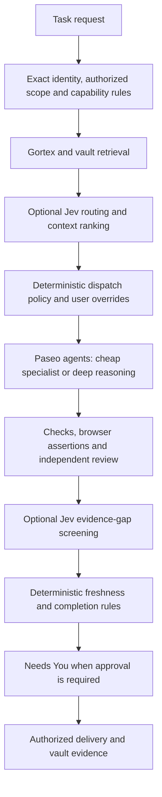

# Review Deck adoption and Jev research

23 September 2026, America/Los_Angeles. Proposed architecture; documentation only. Companion: [implementation specification](../mission-control-plugin-spec.md).

## Recommendation and research limits

Add an optional Jev decision adapter to Mission Control's server, after deterministic policy and retrieval and before expensive agent dispatch. Use it again to screen execution evidence. Paseo owns sessions and permissions; Development Kit owns workflow requirements; Gortex owns code relationships; dev-vault owns durable task/run evidence. Jev supplies recommendations, never authorization or proof of completion.

Research examined upstream documentation, GitHub metadata, manifests, repository trees and selected source. No packages were installed, paid APIs invoked or upstream tests executed. Tests listed here exist upstream; they were not independently run. These repositories are days old, so test badges and releases do not establish production reliability.

## Review Deck adoption notes

Installed Review Deck 1.1.0 supplies useful file navigation, split/unified diffs, hunk comments, reviewed progress, snapshot fingerprints and explicit agent handoff. `/review-deck` opens its agent-context panel. Borrow these for a Mission Control Review surface backed by task/run evidence. [Upstream](https://github.com/mentalfl0w/review-deck).

The observed `fatal: ambiguous argument 'HEAD'` occurred in a repository with no commits. Working/staged diff collection assumes HEAD. Plan an empty-tree baseline appropriate to the repository object format, plus staged/untracked discovery; distinguish unborn HEAD from an invalid user-selected revision. Test unborn all-untracked, staged-only and mixed states, normal/detached HEAD, empty scope, binary files, renames and deletions. Do not create commits or refs just to enable review.

The screenshot showed DONE and Snapshot current despite failure and no snapshot. Loading, empty, current, stale and error need truthful states. Failed collection is never completed-review evidence.

Other installed-source findings to carry into implementation:

- Persist Open → Submitted → Awaiting verification → Resolved findings in dev-vault. Sending is not resolution.
- Snapshot exact finding IDs and versions before handoff. ReviewService's asynchronous send followed by project-wide comment clearing can delete comments added during the send.
- Surface storage read/parse failures and preserve the original; never convert every error to an empty store that is later overwritten.
- Scope records by exact host/project/workspace/task/run and content fingerprint. A project aggregate does not authorize sending all its comments to one agent.
- Enforce reviewer restrictions through provider permissions, not a read-only sentence in a prompt.
- Start with diffs, annotations and explicit handoff; defer destructive hunk/file revert until stale-snapshot and authorization checks exist.

## What Jev can contribute

Jev evaluates text with Choice, Score and Noul questions rather than generating prose. Independent questions can share a request; dependent stages remain code-controlled. [Official introduction](https://docs.typesafe.ai/introduction).

Published direct pricing for `jev-1.13.0` is $0.042 per million input tokens, output free. A 3,000-token input costs about $0.000126; 1,000 such calls cost $0.126 before retries and surrounding work. It is text-only. Pin the model version. [Specifications](https://docs.typesafe.ai/models).

Typed output is not correctness. Known weaknesses include arithmetic, dates, indirection, distracting context and adversarial state. Keep revision comparisons, permissions and counters deterministic. [Known limits](https://docs.typesafe.ai/model-jaggedness/jev-1.13). Choice/Score confidence describes distribution concentration; Noul has a probability but no separate confidence. Calibrate by question and consequence rather than using one universal threshold. [Confidence](https://docs.typesafe.ai/confidence).

## Repository assessments

### jkudish/jev-mcp: integrate selectively

Version 0.6.0, Node 20+, created September 17. MCP tools cover verification, screening, finding/reranking, classification, bounded decisions, comparison, extraction, review and completion claims. It works with MCP clients including Codex, Claude Code and OpenCode; it is neither a code index nor a session manager. Unit/mock/provider tests, live-test entry points and CI exist. [Tool contracts](https://github.com/jkudish/jev-mcp).

Use rerank/find for optional Gortex candidates and verify/review/gate for advisory evidence screening. Preserve mandatory context; surface truncation and partial/invalid results. A tool called gate is not a platform gate. Automatic pre-dispatch decisions should call a server adapter directly, avoiding an expensive agent turn merely to invoke MCP.

### jkudish/jev-browser: bounded QA prototype

Version 0.5.0, Node 22+, created September 17. MCP/CLI/library navigation uses Playwright, DOM state and Jev action selection. Text entry may use a separate generative model. It produces traces, screenshots and browser-error observations. Unit/transport tests, live fixtures and CI exist; broad reliability is unproven. [Upstream](https://github.com/jkudish/jev-browser).

Use it to navigate disposable test environments, then run independent assertions and attach evidence to the task run. Cap steps/time and escalate ambiguous flows. Start with an owned browser: accepting an injected Playwright Page does not demonstrate compatibility with Paseo's browser surfaces. Include text-model costs; a goal judgment is not a test pass. Consequential form submission still needs the underlying action's authorization.

### devagrawal09/jev-review: borrow architecture

This is the repository assessed for `jev-review`, distinct from the MCP tool `jev_review`. Version 0.1.0, created September 16. CLI/dashboard stages risk screening, file selection, evidence, mechanism and severity decisions for changes or whole-codebase scans. It calls findings review prompts rather than defect proof and lacks compiler/static-analysis/index integration. The inspected tree had no test suite; its check script covers types, dependency flow and dashboard syntax. [Upstream](https://github.com/devagrawal09/jev-review).

Borrow staged evidence selection and specialist escalation; retain Mission Control UI and Gortex context. Its collector runs `git diff HEAD` before untracked discovery and filters out deleted paths. It therefore repeats Review Deck's unborn-HEAD assumption. Do not adopt the collector unchanged. [Git adapter lines 19–40](https://github.com/devagrawal09/jev-review/blob/31f89602797fb7bea007f8a480bf368bf564954e/src/adapters/git.ts#L19-L40).

### auto-mode-for-paseo: borrow routing, isolate a Codex pilot

`obetomuniz/auto-mode-for-paseo` 0.2.0, created September 21, is a custom Paseo provider. Jev or experimental local Laya classifies messages and chooses Codex model/effort/mode while preserving the Codex thread. It is not a general multi-provider scheduler. Tests simulate services; CI and Windows tooling exist. [README](https://github.com/obetomuniz/auto-mode-for-paseo).

Borrow manual overrides, bounded context and separate model-tier/permission decisions. Compatibility needs testing: experimental Codex App Server fields, a documented CLI version, and no composer-command support. Exercise `/mission-task` and `/review-deck` paths; provider commands and native plugin commands may differ. Images reach Codex, but routing sees text. Errors or invalid intent can stop a turn; routing lanes do not launch workers. [Architecture](https://github.com/obetomuniz/auto-mode-for-paseo/blob/main/ARCHITECTURE.md).

Do not replace every provider. Keep Mission Control's decision contract provider-neutral and pilot this separately for Codex. Treat Laya as a later local comparison baseline, not an assumed equivalent replacement.

### jev-kit: borrow components, skip wholesale installation

`jonathanavis96/jev-kit`, created September 19, combines Claude Code hooks for tool hygiene and subagent tier selection with search, browser, review and verification helpers. Tests and reported evaluations exist, but components have different maturity. Airlock deliberately fails open and is not a security control. Its tier guard discourages expensive dispatch without automatically correcting an underpowered assignment upward. [Upstream](https://github.com/jonathanavis96/jev-kit).

Borrow rules-before-model, redaction, configurable tiers, shadow evaluation and bounded retries. Avoid global search/browser redirection and updater behavior that could conflict with Gortex or existing policies. Defer optional compaction and its raw-context exposure until retention and recall are separately evaluated.

### jev-belay: borrow evidence-first completion checks

`valentynkit/jev-belay` is a Claude Code Stop hook. It inspects mutations and fresh checks before asking Jev about unverified completion. Offline tests and a small published evaluation exist, but evaluation labels came from a model; errors fail open, and read-only false claims and multi-turn scope are documented gaps. [Upstream](https://github.com/valentynkit/jev-belay).

Use structured Mission Control run/check records instead of transcript regexes. Include review-only completion claims. Bound retries and show unresolved evidence in Needs You. A reminder to verify is neither certification nor delivery approval.

### Other useful foundations

`browser-use/jev-ultrafast` is a Python/browser-harness agent with indexed DOM actions, target-freshness checks and a separate text generator. Offline tests and narrow measurements exist; its documented UI limitations and independent verification requirement matter. Borrow target validation and action fan-out. Start with only jev-browser, adding a second stack only if evidence justifies it. [Upstream](https://github.com/browser-use/jev-ultrafast).

Prefer the official `@typesafe-ai/sdk` behind a narrow server DecisionAdapter: typed decisions without another provider or agent turn. [JavaScript SDK](https://docs.typesafe.ai/sdk/javascript). Official [skill suggestion](https://docs.typesafe.ai/cookbooks/skill_suggestion) and [reranking](https://docs.typesafe.ai/cookbooks/rerank_typesafe) examples can seed evaluations, without introducing another index.

## Compatibility and authority

| System | Proposed relationship |
| --- | --- |
| Mission Control | Routing policy, Needs You, overrides, evidence display and durable decisions. |
| Development Kit | Skill contracts, approved scope, validation and role separation; Jev suggests only. |
| Paseo | Sessions, workspace placement, lifecycle and native permission flows through supported APIs. |
| Codex | Normal provider plus MCP; optional separate Auto Mode pilot with version/turn-state checks. |
| Claude Code | MCP; separately scoped hook pilots if desired. |
| OpenCode | MCP or common server adapter; Auto Mode and Claude hooks are not demonstrated drop-ins. |
| Gortex | Retrieve relationships and mandatory evidence first; Jev ranks optional candidates only. |
| Multiple agents | Jev suggests bounded role/tier/parallelism; scheduler owns authorization, dependencies, ownership, budgets and cancellation. Keep reviewer independence. |

No recommendation grants human approval. Existing authorized scope persists; only transitions that actually require approval wait for an authorized decision.

## Proposed architecture

DecisionAdapter accepts an immutable snapshot and finite allowed choices. Return recommendation, uncertainty, evidence IDs, policy/question/model versions, latency and usage. Explanations should be evidence-linked templates or separately labeled generated explanations; Jev does not generate rationales.

Bind decisions to host/project/workspace/task/run, document revision and code content fingerprint, including dirty/untracked files. Reject late responses after cancellation, revision change or a newer generation. Deduplicate dispatch and serialize assignment changes; do not create another writer of task truth.

If optional routing fails, use the configured ordinary agent and required context, never silently the cheapest agent. Missing evidence remains unverified during outages. Deterministic policy checks require no model. Keep keys server-side, minimize/redact outbound content and make transport choice explicit. Source/page text is untrusted data.

## Cost and evaluation

Measure cost per correctly completed task: classification + execution + escalation/rework + review + browser/text-generation. Reduced Claude spend alone is not total savings.

Begin in shadow mode with representative historical cases and a held-out set. Include short follow-ups, image-only tasks, concurrent edits, cross-component changes, data-loss risks, missing evidence and malicious text. Compare deterministic routing, current agent selection and Jev-assisted selection. Measure p50/p95 latency, total spend, rework, context recall, missed defects, false completion and overrides. Required-evidence recall and no unauthorized transitions are hard constraints. Calibrate per question/risk, include unknown/escalate, and re-evaluate model/prompt changes.

## First four prototypes, in order

1. **Shadow task/agent router:** official SDK adapter, borrowing Auto Mode overrides and session principles. Suggest skill, role, tier and effort before enabling any automatic low-risk route.
2. **Gortex context selector:** jev-mcp rerank/find over optional candidates with stable IDs. Preserve instructions, contracts, changed symbols and impacted tests. Measure token savings and omitted necessary evidence.
3. **Evidence/review triage:** borrow jev-review staging and Belay's evidence-first pattern; use verify/gate selectively. Send actual diff and validation records to independent deep reviewers when needed. Completion/approval remain deterministic.
4. **Bounded browser QA:** jev-browser on disposable fixtures with independent assertions, trace artifacts, budgets and escalation for complex visual flows.

## Revision evidence

GitHub HEADs observed during research; some UTC dates fall on September 24 while still September 23 locally. Pin and re-review before installing.

| Repository | Observed HEAD |
| --- | --- |
| jkudish/jev-mcp | `eb926594da6252a7b4eefd7f50dde566913c541e` |
| jkudish/jev-browser | `07841380fec83543cfe8e09218771cbe0664e8da` |
| devagrawal09/jev-review | `31f89602797fb7bea007f8a480bf368bf564954e` |
| obetomuniz/auto-mode-for-paseo | `9924c09d1a37f33e845bbe6d8418eb641888de2b` |
| jonathanavis96/jev-kit | `36e53a4054c8220acd087b42bdcb0aa071ccf28f` |
| browser-use/jev-ultrafast | `1231850a0bf1a0c0341fe408ef1668dbbfdfac46` |

Metadata/manifests/trees were sampled at these revisions. Links to main remain moving references. This is architecture research, not an exhaustive source audit or reproduced benchmark.
